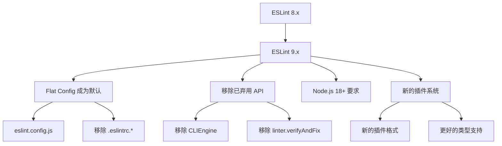
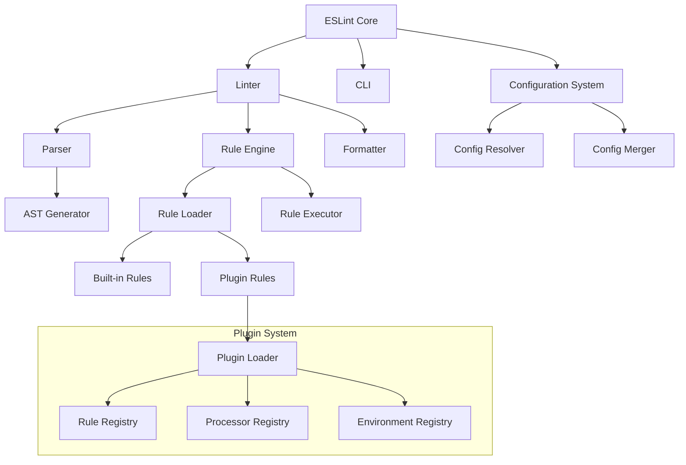

# ESLint 工程化实践指南

深入探讨 ESLint 在现代前端工程化中的应用，从基础配置到高级定制，打造团队级代码质量保障体系。

## ESLint 9+ 升级指南

### 重大变更概览



### 配置文件迁移

#### 从 .eslintrc.js 迁移到 eslint.config.js

```javascript
// 旧配置 (.eslintrc.js)
module.exports = {
  env: {
    browser: true,
    es2021: true,
    node: true
  },
  extends: [
    'eslint:recommended',
    '@typescript-eslint/recommended',
    'plugin:react/recommended',
    'plugin:react-hooks/recommended'
  ],
  parser: '@typescript-eslint/parser',
  parserOptions: {
    ecmaFeatures: {
      jsx: true
    },
    ecmaVersion: 'latest',
    sourceType: 'module'
  },
  plugins: [
    'react',
    '@typescript-eslint',
    'react-hooks'
  ],
  rules: {
    'indent': ['error', 2],
    'linebreak-style': ['error', 'unix'],
    'quotes': ['error', 'single'],
    'semi': ['error', 'always']
  },
  settings: {
    react: {
      version: 'detect'
    }
  }
};
```

```javascript
// 新配置 (eslint.config.js)
import js from '@eslint/js';
import typescript from '@typescript-eslint/eslint-plugin';
import typescriptParser from '@typescript-eslint/parser';
import react from 'eslint-plugin-react';
import reactHooks from 'eslint-plugin-react-hooks';
import globals from 'globals';

export default [
  // 基础 JavaScript 推荐配置
  js.configs.recommended,
  
  // 全局配置
  {
    languageOptions: {
      globals: {
        ...globals.browser,
        ...globals.node,
        ...globals.es2021
      },
      ecmaVersion: 'latest',
      sourceType: 'module'
    }
  },
  
  // TypeScript 配置
  {
    files: ['**/*.{ts,tsx}'],
    languageOptions: {
      parser: typescriptParser,
      parserOptions: {
        ecmaFeatures: {
          jsx: true
        }
      }
    },
    plugins: {
      '@typescript-eslint': typescript
    },
    rules: {
      ...typescript.configs.recommended.rules,
      '@typescript-eslint/no-unused-vars': 'error',
      '@typescript-eslint/no-explicit-any': 'warn'
    }
  },
  
  // React 配置
  {
    files: ['**/*.{jsx,tsx}'],
    plugins: {
      react,
      'react-hooks': reactHooks
    },
    rules: {
      ...react.configs.recommended.rules,
      ...reactHooks.configs.recommended.rules,
      'react/react-in-jsx-scope': 'off', // React 17+
      'react/prop-types': 'off' // 使用 TypeScript
    },
    settings: {
      react: {
        version: 'detect'
      }
    }
  },
  
  // 通用规则
  {
    rules: {
      'indent': ['error', 2],
      'linebreak-style': ['error', 'unix'],
      'quotes': ['error', 'single'],
      'semi': ['error', 'always'],
      'no-console': 'warn',
      'no-debugger': 'error'
    }
  },
  
  // 忽略文件
  {
    ignores: [
      'dist/**',
      'build/**',
      'node_modules/**',
      '*.min.js',
      'coverage/**'
    ]
  }
];
```

### 迁移工具和脚本

```javascript
// migrate-eslint.js - 自动迁移脚本
import { readFileSync, writeFileSync, existsSync } from 'fs';
import { join } from 'path';

class ESLintMigrator {
  constructor(projectPath) {
    this.projectPath = projectPath;
    this.oldConfigFiles = [
      '.eslintrc.js',
      '.eslintrc.json',
      '.eslintrc.yml',
      '.eslintrc.yaml'
    ];
  }
  
  findOldConfig() {
    for (const file of this.oldConfigFiles) {
      const filePath = join(this.projectPath, file);
      if (existsSync(filePath)) {
        return { file, path: filePath };
      }
    }
    return null;
  }
  
  parseOldConfig(configPath) {
    const content = readFileSync(configPath, 'utf8');
    
    if (configPath.endsWith('.js')) {
      // 动态导入旧配置
      return require(configPath);
    } else if (configPath.endsWith('.json')) {
      return JSON.parse(content);
    }
    // 处理 YAML 格式...
  }
  
  convertToFlatConfig(oldConfig) {
    const flatConfig = [];
    
    // 转换基础配置
    if (oldConfig.extends) {
      flatConfig.push(this.convertExtends(oldConfig.extends));
    }
    
    // 转换环境配置
    if (oldConfig.env) {
      flatConfig.push(this.convertEnv(oldConfig.env));
    }
    
    // 转换解析器配置
    if (oldConfig.parser || oldConfig.parserOptions) {
      flatConfig.push(this.convertParser(oldConfig));
    }
    
    // 转换插件和规则
    if (oldConfig.plugins || oldConfig.rules) {
      flatConfig.push(this.convertPluginsAndRules(oldConfig));
    }
    
    return flatConfig;
  }
  
  convertExtends(extendsConfig) {
    const extends = Array.isArray(extendsConfig) ? extendsConfig : [extendsConfig];
    const imports = [];
    const configs = [];
    
    extends.forEach(ext => {
      if (ext === 'eslint:recommended') {
        imports.push("import js from '@eslint/js';");
        configs.push('js.configs.recommended');
      } else if (ext.startsWith('@typescript-eslint')) {
        imports.push("import typescript from '@typescript-eslint/eslint-plugin';");
        configs.push('typescript.configs.recommended');
      }
      // 处理其他 extends...
    });
    
    return { imports, configs };
  }
  
  generateNewConfig(flatConfig) {
    return `// ESLint 9+ Flat Config
// 自动从旧配置迁移生成

${flatConfig.imports.join('\n')}

export default [
${flatConfig.configs.map(config => `  ${config},`).join('\n')}
  
  // 自定义规则
  {
    rules: {
${Object.entries(flatConfig.rules || {})
  .map(([rule, value]) => `      '${rule}': ${JSON.stringify(value)}`)
  .join(',\n')}
    }
  }
];
`;
  }
  
  migrate() {
    const oldConfig = this.findOldConfig();
    if (!oldConfig) {
      console.log('未找到旧的 ESLint 配置文件');
      return;
    }
    
    console.log(`发现旧配置文件: ${oldConfig.file}`);
    
    const parsedConfig = this.parseOldConfig(oldConfig.path);
    const flatConfig = this.convertToFlatConfig(parsedConfig);
    const newConfigContent = this.generateNewConfig(flatConfig);
    
    const newConfigPath = join(this.projectPath, 'eslint.config.js');
    writeFileSync(newConfigPath, newConfigContent);
    
    console.log('✅ 迁移完成！新配置文件: eslint.config.js');
    console.log('⚠️  请手动检查并调整配置，然后删除旧配置文件');
  }
}

// 使用示例
const migrator = new ESLintMigrator(process.cwd());
migrator.migrate();
```

## 前端工程规范体系

### 代码规范

#### 1. JavaScript/TypeScript 规范

```javascript
// eslint.config.js - JavaScript/TypeScript 规范配置
export default [
  {
    name: 'javascript-standards',
    files: ['**/*.{js,mjs,cjs}'],
    rules: {
      // 代码风格
      'indent': ['error', 2, { 
        SwitchCase: 1,
        VariableDeclarator: 1,
        outerIIFEBody: 1,
        FunctionDeclaration: { parameters: 1, body: 1 },
        FunctionExpression: { parameters: 1, body: 1 },
        CallExpression: { arguments: 1 },
        ArrayExpression: 1,
        ObjectExpression: 1,
        ImportDeclaration: 1,
        flatTernaryExpressions: false,
        ignoreComments: false
      }],
      'quotes': ['error', 'single', { 
        avoidEscape: true,
        allowTemplateLiterals: true 
      }],
      'semi': ['error', 'always'],
      'comma-dangle': ['error', 'never'],
      'comma-spacing': ['error', { before: false, after: true }],
      'comma-style': ['error', 'last'],
      'key-spacing': ['error', { beforeColon: false, afterColon: true }],
      'object-curly-spacing': ['error', 'always'],
      'array-bracket-spacing': ['error', 'never'],
      'space-before-blocks': ['error', 'always'],
      'space-before-function-paren': ['error', {
        anonymous: 'always',
        named: 'never',
        asyncArrow: 'always'
      }],
      
      // 变量声明
      'no-var': 'error',
      'prefer-const': 'error',
      'no-unused-vars': ['error', { 
        vars: 'all',
        args: 'after-used',
        ignoreRestSiblings: true 
      }],
      'no-undef': 'error',
      'no-redeclare': 'error',
      
      // 函数
      'func-style': ['error', 'declaration', { allowArrowFunctions: true }],
      'prefer-arrow-callback': 'error',
      'arrow-spacing': ['error', { before: true, after: true }],
      'arrow-parens': ['error', 'as-needed'],
      
      // 对象和数组
      'object-shorthand': ['error', 'always'],
      'prefer-destructuring': ['error', {
        array: true,
        object: true
      }, {
        enforceForRenamedProperties: false
      }],
      
      // 字符串
      'prefer-template': 'error',
      'template-curly-spacing': ['error', 'never'],
      
      // 最佳实践
      'eqeqeq': ['error', 'always'],
      'no-eval': 'error',
      'no-implied-eval': 'error',
      'no-new-func': 'error',
      'no-return-assign': 'error',
      'no-sequences': 'error',
      'no-throw-literal': 'error',
      'no-unmodified-loop-condition': 'error',
      'no-unused-expressions': 'error',
      'no-useless-call': 'error',
      'no-useless-concat': 'error',
      'no-useless-return': 'error',
      'prefer-promise-reject-errors': 'error',
      'require-await': 'error',
      
      // ES6+
      'no-duplicate-imports': 'error',
      'no-useless-computed-key': 'error',
      'no-useless-constructor': 'error',
      'no-useless-rename': 'error',
      'rest-spread-spacing': ['error', 'never'],
      'symbol-description': 'error'
    }
  },
  
  {
    name: 'typescript-standards',
    files: ['**/*.{ts,tsx}'],
    languageOptions: {
      parser: typescriptParser
    },
    plugins: {
      '@typescript-eslint': typescript
    },
    rules: {
      // TypeScript 特定规则
      '@typescript-eslint/no-unused-vars': ['error', { 
        argsIgnorePattern: '^_',
        varsIgnorePattern: '^_' 
      }],
      '@typescript-eslint/no-explicit-any': 'warn',
      '@typescript-eslint/no-non-null-assertion': 'warn',
      '@typescript-eslint/prefer-nullish-coalescing': 'error',
      '@typescript-eslint/prefer-optional-chain': 'error',
      '@typescript-eslint/prefer-as-const': 'error',
      '@typescript-eslint/no-unnecessary-type-assertion': 'error',
      '@typescript-eslint/no-unnecessary-type-constraint': 'error',
      '@typescript-eslint/ban-ts-comment': ['error', {
        'ts-expect-error': 'allow-with-description',
        'ts-ignore': false,
        'ts-nocheck': false,
        'ts-check': false
      }],
      
      // 命名约定
      '@typescript-eslint/naming-convention': [
        'error',
        {
          selector: 'variableLike',
          format: ['camelCase', 'PascalCase', 'UPPER_CASE']
        },
        {
          selector: 'function',
          format: ['camelCase', 'PascalCase']
        },
        {
          selector: 'typeLike',
          format: ['PascalCase']
        },
        {
          selector: 'interface',
          format: ['PascalCase'],
          prefix: ['I']
        },
        {
          selector: 'enum',
          format: ['PascalCase']
        },
        {
          selector: 'enumMember',
          format: ['UPPER_CASE']
        }
      ],
      
      // 类型定义
      '@typescript-eslint/consistent-type-definitions': ['error', 'interface'],
      '@typescript-eslint/consistent-type-imports': ['error', {
        prefer: 'type-imports',
        disallowTypeAnnotations: false
      }],
      '@typescript-eslint/explicit-function-return-type': ['warn', {
        allowExpressions: true,
        allowTypedFunctionExpressions: true
      }],
      '@typescript-eslint/explicit-module-boundary-types': 'warn'
    }
  }
];
```

#### 2. React 组件规范

```javascript
// React 专用配置
export const reactConfig = {
  name: 'react-standards',
  files: ['**/*.{jsx,tsx}'],
  plugins: {
    react,
    'react-hooks': reactHooks,
    'jsx-a11y': jsxA11y
  },
  rules: {
    // React 基础规则
    'react/react-in-jsx-scope': 'off', // React 17+
    'react/prop-types': 'off', // 使用 TypeScript
    'react/display-name': 'error',
    'react/no-array-index-key': 'warn',
    'react/no-danger': 'warn',
    'react/no-deprecated': 'error',
    'react/no-direct-mutation-state': 'error',
    'react/no-find-dom-node': 'error',
    'react/no-is-mounted': 'error',
    'react/no-render-return-value': 'error',
    'react/no-string-refs': 'error',
    'react/no-unescaped-entities': 'error',
    'react/no-unknown-property': 'error',
    'react/no-unsafe': 'error',
    'react/require-render-return': 'error',
    
    // JSX 规则
    'react/jsx-boolean-value': ['error', 'never'],
    'react/jsx-closing-bracket-location': ['error', 'line-aligned'],
    'react/jsx-closing-tag-location': 'error',
    'react/jsx-curly-spacing': ['error', 'never'],
    'react/jsx-equals-spacing': ['error', 'never'],
    'react/jsx-first-prop-new-line': ['error', 'multiline-multiprop'],
    'react/jsx-indent': ['error', 2],
    'react/jsx-indent-props': ['error', 2],
    'react/jsx-key': ['error', { checkFragmentShorthand: true }],
    'react/jsx-max-props-per-line': ['error', { maximum: 1, when: 'multiline' }],
    'react/jsx-no-bind': ['error', {
      ignoreRefs: true,
      allowArrowFunctions: true,
      allowFunctions: false,
      allowBind: false,
      ignoreDOMComponents: true
    }],
    'react/jsx-no-duplicate-props': 'error',
    'react/jsx-no-literals': 'off',
    'react/jsx-no-undef': 'error',
    'react/jsx-pascal-case': 'error',
    'react/jsx-props-no-spreading': ['warn', {
      html: 'enforce',
      custom: 'enforce',
      explicitSpread: 'ignore'
    }],
    'react/jsx-tag-spacing': ['error', {
      closingSlash: 'never',
      beforeSelfClosing: 'always',
      afterOpening: 'never',
      beforeClosing: 'never'
    }],
    'react/jsx-uses-react': 'error',
    'react/jsx-uses-vars': 'error',
    'react/jsx-wrap-multilines': ['error', {
      declaration: 'parens-new-line',
      assignment: 'parens-new-line',
      return: 'parens-new-line',
      arrow: 'parens-new-line',
      condition: 'parens-new-line',
      logical: 'parens-new-line',
      prop: 'parens-new-line'
    }],
    
    // Hooks 规则
    'react-hooks/rules-of-hooks': 'error',
    'react-hooks/exhaustive-deps': 'warn',
    
    // 无障碍性规则
    'jsx-a11y/alt-text': 'error',
    'jsx-a11y/anchor-has-content': 'error',
    'jsx-a11y/anchor-is-valid': 'error',
    'jsx-a11y/aria-activedescendant-has-tabindex': 'error',
    'jsx-a11y/aria-props': 'error',
    'jsx-a11y/aria-proptypes': 'error',
    'jsx-a11y/aria-role': 'error',
    'jsx-a11y/aria-unsupported-elements': 'error',
    'jsx-a11y/click-events-have-key-events': 'error',
    'jsx-a11y/heading-has-content': 'error',
    'jsx-a11y/html-has-lang': 'error',
    'jsx-a11y/img-redundant-alt': 'error',
    'jsx-a11y/interactive-supports-focus': 'error',
    'jsx-a11y/label-has-associated-control': 'error',
    'jsx-a11y/mouse-events-have-key-events': 'error',
    'jsx-a11y/no-access-key': 'error',
    'jsx-a11y/no-autofocus': 'error',
    'jsx-a11y/no-distracting-elements': 'error',
    'jsx-a11y/no-interactive-element-to-noninteractive-role': 'error',
    'jsx-a11y/no-noninteractive-element-interactions': 'error',
    'jsx-a11y/no-noninteractive-element-to-interactive-role': 'error',
    'jsx-a11y/no-redundant-roles': 'error',
    'jsx-a11y/no-static-element-interactions': 'error',
    'jsx-a11y/role-has-required-aria-props': 'error',
    'jsx-a11y/role-supports-aria-props': 'error',
    'jsx-a11y/scope': 'error',
    'jsx-a11y/tabindex-no-positive': 'error'
  }
};
```

### 文件结构规范

```javascript
// file-structure.config.js - 文件结构规范配置
export default [
  {
    name: 'file-structure-rules',
    plugins: {
      'file-structure': fileStructurePlugin
    },
    rules: {
      // 文件命名规范
      'file-structure/naming-convention': ['error', {
        // 组件文件使用 PascalCase
        'src/components/**/*.{tsx,jsx}': 'PascalCase',
        // 页面文件使用 PascalCase
        'src/pages/**/*.{tsx,jsx}': 'PascalCase',
        // Hook 文件使用 camelCase，以 use 开头
        'src/hooks/**/*.{ts,tsx}': '^use[A-Z].*',
        // 工具函数使用 camelCase
        'src/utils/**/*.{ts,js}': 'camelCase',
        // 类型定义文件使用 camelCase
        'src/types/**/*.{ts}': 'camelCase',
        // 常量文件使用 UPPER_CASE
        'src/constants/**/*.{ts,js}': 'UPPER_CASE',
        // 配置文件使用 kebab-case
        'config/**/*.{ts,js,json}': 'kebab-case',
        // 测试文件
        '**/*.{test,spec}.{ts,tsx,js,jsx}': 'camelCase'
      }],
      
      // 目录结构规范
      'file-structure/folder-structure': ['error', {
        // 强制的目录结构
        required: [
          'src/',
          'src/components/',
          'src/pages/',
          'src/hooks/',
          'src/utils/',
          'src/types/',
          'src/constants/',
          'src/assets/',
          'src/styles/',
          'tests/',
          'docs/'
        ],
        // 禁止的目录结构
        forbidden: [
          'src/component/', // 应该是 components
          'src/page/', // 应该是 pages
          'src/util/', // 应该是 utils
          'src/type/' // 应该是 types
        ]
      }],
      
      // 文件大小限制
      'file-structure/max-file-size': ['warn', {
        maxSize: 500, // 500 行
        exclude: [
          '**/*.config.{js,ts}',
          '**/*.d.ts',
          '**/index.{js,ts}'
        ]
      }],
      
      // 导入路径规范
      'file-structure/import-path': ['error', {
        // 强制使用绝对路径导入
        'src/**/*.{ts,tsx,js,jsx}': {
          // 同级目录可以使用相对路径
          allowRelative: 'same-folder',
          // 其他情况使用绝对路径
          preferAbsolute: true,
          // 路径别名配置
          aliases: {
            '@': 'src',
            '@components': 'src/components',
            '@pages': 'src/pages',
            '@hooks': 'src/hooks',
            '@utils': 'src/utils',
            '@types': 'src/types',
            '@constants': 'src/constants',
            '@assets': 'src/assets',
            '@styles': 'src/styles'
          }
        }
      }]
    }
  },
  
  // 组件文件结构规范
  {
    name: 'component-structure',
    files: ['src/components/**/*.{tsx,jsx}'],
    rules: {
      // 组件导出规范
      'file-structure/component-export': ['error', {
        // 强制默认导出
        defaultExport: true,
        // 组件名必须与文件名一致
        matchFileName: true,
        // 允许的导出模式
        allowedPatterns: [
          // 默认导出 + 命名导出类型
          'export default Component; export type { ComponentProps };',
          // 仅默认导出
          'export default Component;'
        ]
      }),
      
      // 组件内部结构顺序
      'file-structure/component-order': ['error', {
        order: [
          'imports',
          'types',
          'interfaces',
          'constants',
          'styled-components',
          'component',
          'default-export'
        ]
      }]
    }
  }
];
```

### 提交规范

#### Conventional Commits 规范

```bash
# 提交消息格式
<type>[optional scope]: <description>

[optional body]

[optional footer(s)]
```

**类型说明：**
- `feat`: 新功能
- `fix`: 修复 bug
- `docs`: 文档更新
- `style`: 代码格式（不影响代码运行的变动）
- `refactor`: 重构（既不是新增功能，也不是修改 bug 的代码变动）
- `perf`: 性能优化
- `test`: 增加测试
- `chore`: 构建过程或辅助工具的变动
- `ci`: CI 配置文件和脚本的变动
- `build`: 影响构建系统或外部依赖的更改
- `revert`: 回滚之前的提交

**示例：**
```bash
feat(auth): add user login functionality

Implement JWT-based authentication with:
- Login form validation
- Token storage in localStorage
- Auto-redirect after successful login

Closes #123
```

#### Commitlint 配置

**安装依赖：**
```bash
npm install --save-dev @commitlint/config-conventional @commitlint/cli
```

**commitlint.config.js：**
```javascript
module.exports = {
  extends: ['@commitlint/config-conventional'],
  rules: {
    'type-enum': [
      2,
      'always',
      [
        'feat',
        'fix',
        'docs',
        'style',
        'refactor',
        'perf',
        'test',
        'chore',
        'ci',
        'build',
        'revert'
      ]
    ],
    'type-case': [2, 'always', 'lower-case'],
    'type-empty': [2, 'never'],
    'scope-case': [2, 'always', 'lower-case'],
    'subject-case': [2, 'never', ['sentence-case', 'start-case', 'pascal-case', 'upper-case']],
    'subject-empty': [2, 'never'],
    'subject-full-stop': [2, 'never', '.'],
    'header-max-length': [2, 'always', 72],
    'body-leading-blank': [1, 'always'],
    'body-max-line-length': [2, 'always', 100],
    'footer-leading-blank': [1, 'always'],
    'footer-max-line-length': [2, 'always', 100]
  }
};
```

## Husky 工作流配置

### 安装和初始化

```bash
# 安装 Husky
npm install --save-dev husky

# 初始化 Husky
npx husky install

# 添加 prepare 脚本（确保团队成员安装依赖时自动启用 hooks）
npm pkg set scripts.prepare="husky install"
```

### Git Hooks 配置

#### pre-commit Hook

```bash
# 创建 pre-commit hook
npx husky add .husky/pre-commit "npm run lint-staged"
```

**lint-staged 配置（package.json）：**
```json
{
  "lint-staged": {
    "*.{js,jsx,ts,tsx}": [
      "eslint --fix",
      "prettier --write"
    ],
    "*.{css,scss,less}": [
      "stylelint --fix",
      "prettier --write"
    ],
    "*.{json,md,yml,yaml}": [
      "prettier --write"
    ]
  }
}
```

#### commit-msg Hook

```bash
# 创建 commit-msg hook
npx husky add .husky/commit-msg 'npx --no -- commitlint --edit ${1}'
```

#### pre-push Hook

```bash
# 创建 pre-push hook
npx husky add .husky/pre-push "npm run test && npm run build"
```

### 完整的 Husky 工作流

**.husky/pre-commit：**
```bash
#!/usr/bin/env sh
. "$(dirname -- "$0")/_/husky.sh"

# 运行 lint-staged
npm run lint-staged

# 类型检查
npm run type-check

# 运行单元测试（仅针对暂存文件）
npm run test:staged
```

**.husky/commit-msg：**
```bash
#!/usr/bin/env sh
. "$(dirname -- "$0")/_/husky.sh"

# 验证提交消息格式
npx --no -- commitlint --edit ${1}

# 检查提交消息长度和格式
node scripts/validate-commit-msg.js ${1}
```

**.husky/pre-push：**
```bash
#!/usr/bin/env sh
. "$(dirname -- "$0")/_/husky.sh"

# 运行完整测试套件
npm run test:ci

# 构建检查
npm run build

# 安全检查
npm audit --audit-level moderate

# 依赖检查
npm run check-deps
```

### 高级配置

#### 条件性 Hook 执行

**scripts/conditional-hooks.js：**
```javascript
const { execSync } = require('child_process');
const fs = require('fs');

class ConditionalHooks {
  static shouldRunTests() {
    try {
      // 检查是否有测试文件变更
      const changedFiles = execSync('git diff --cached --name-only', { encoding: 'utf8' });
      return changedFiles.includes('.test.') || changedFiles.includes('.spec.');
    } catch (error) {
      return true; // 出错时默认运行
    }
  }

  static shouldRunBuild() {
    try {
      const changedFiles = execSync('git diff --cached --name-only', { encoding: 'utf8' });
      const buildRelatedFiles = ['.js', '.ts', '.jsx', '.tsx', '.json', '.yml', '.yaml'];
      return buildRelatedFiles.some(ext => changedFiles.includes(ext));
    } catch (error) {
      return true;
    }
  }

  static getBranchName() {
    try {
      return execSync('git rev-parse --abbrev-ref HEAD', { encoding: 'utf8' }).trim();
    } catch (error) {
      return 'unknown';
    }
  }

  static isProtectedBranch() {
    const protectedBranches = ['main', 'master', 'develop', 'release/*'];
    const currentBranch = this.getBranchName();
    return protectedBranches.some(pattern => {
      if (pattern.includes('*')) {
        const regex = new RegExp(pattern.replace('*', '.*'));
        return regex.test(currentBranch);
      }
      return currentBranch === pattern;
    });
  }
}

module.exports = ConditionalHooks;
```

#### 智能 lint-staged 配置

**scripts/smart-lint-staged.js：**
```javascript
const { execSync } = require('child_process');
const path = require('path');

class SmartLintStaged {
  static getChangedFiles() {
    try {
      const output = execSync('git diff --cached --name-only', { encoding: 'utf8' });
      return output.trim().split('\n').filter(Boolean);
    } catch (error) {
      return [];
    }
  }

  static categorizeFiles(files) {
    const categories = {
      typescript: [],
      javascript: [],
      react: [],
      styles: [],
      configs: [],
      tests: [],
      docs: []
    };

    files.forEach(file => {
      const ext = path.extname(file);
      const basename = path.basename(file);

      if (ext === '.ts' || ext === '.tsx') {
        categories.typescript.push(file);
        if (ext === '.tsx' || file.includes('component') || file.includes('Component')) {
          categories.react.push(file);
        }
      } else if (ext === '.js' || ext === '.jsx') {
        categories.javascript.push(file);
        if (ext === '.jsx' || file.includes('component') || file.includes('Component')) {
          categories.react.push(file);
        }
      } else if (['.css', '.scss', '.less', '.sass'].includes(ext)) {
        categories.styles.push(file);
      } else if (basename.includes('config') || basename.includes('.config.')) {
        categories.configs.push(file);
      } else if (file.includes('.test.') || file.includes('.spec.')) {
        categories.tests.push(file);
      } else if (['.md', '.mdx'].includes(ext)) {
        categories.docs.push(file);
      }
    });

    return categories;
  }

  static generateLintCommands(categories) {
    const commands = [];

    if (categories.typescript.length > 0) {
      commands.push(`npx eslint ${categories.typescript.join(' ')} --fix`);
      commands.push(`npx tsc --noEmit`);
    }

    if (categories.javascript.length > 0) {
      commands.push(`npx eslint ${categories.javascript.join(' ')} --fix`);
    }

    if (categories.react.length > 0) {
      commands.push(`npx eslint ${categories.react.join(' ')} --fix --config .eslintrc.react.js`);
    }

    if (categories.styles.length > 0) {
      commands.push(`npx stylelint ${categories.styles.join(' ')} --fix`);
    }

    if (categories.tests.length > 0) {
      commands.push(`npm run test -- --findRelatedTests ${categories.tests.join(' ')}`);
    }

    return commands;
  }

  static run() {
    const changedFiles = this.getChangedFiles();
    if (changedFiles.length === 0) {
      console.log('No files to lint');
      return;
    }

    const categories = this.categorizeFiles(changedFiles);
    const commands = this.generateLintCommands(categories);

    console.log(`Linting ${changedFiles.length} changed files...`);
    
    commands.forEach(command => {
      try {
        console.log(`Running: ${command}`);
        execSync(command, { stdio: 'inherit' });
      } catch (error) {
        console.error(`Command failed: ${command}`);
        process.exit(1);
      }
    });

    console.log('All lint checks passed!');
  }
}

if (require.main === module) {
  SmartLintStaged.run();
}

module.exports = SmartLintStaged;
```

```javascript
// commitlint.config.js - 提交信息规范
module.exports = {
  extends: ['@commitlint/config-conventional'],
  rules: {
    // 类型枚举
    'type-enum': [
      2,
      'always',
      [
        'feat',     // 新功能
        'fix',      // 修复 bug
        'docs',     // 文档更新
        'style',    // 代码格式调整
        'refactor', // 重构
        'perf',     // 性能优化
        'test',     // 测试相关
        'build',    // 构建相关
        'ci',       // CI/CD 相关
        'chore',    // 其他杂项
        'revert'    // 回滚
      ]
    ],
    // 主题长度限制
    'subject-max-length': [2, 'always', 50],
    'subject-min-length': [2, 'always', 10],
    // 主题格式
    'subject-case': [2, 'always', 'lower-case'],
    'subject-empty': [2, 'never'],
    'subject-full-stop': [2, 'never', '.'],
    // 类型格式
    'type-case': [2, 'always', 'lower-case'],
    'type-empty': [2, 'never'],
    // 范围格式
    'scope-case': [2, 'always', 'lower-case'],
    // 正文格式
    'body-leading-blank': [2, 'always'],
    'body-max-line-length': [2, 'always', 100],
    // 脚注格式
    'footer-leading-blank': [2, 'always'],
    'footer-max-line-length': [2, 'always', 100]
  },
  // 自定义解析器
  parserPreset: {
    parserOpts: {
      headerPattern: /^(\w*)(?:\(([\w\$\.\-\*\s]*)\))?\:\s(.*)$/,
      headerCorrespondence: ['type', 'scope', 'subject']
    }
  },
  // 忽略规则
  ignores: [
    commit => commit.includes('WIP'),
    commit => commit.includes('Merge')
  ],
  // 默认忽略
  defaultIgnores: true
};
```

```javascript
// commit-msg-validator.js - 提交信息验证器
import { execSync } from 'child_process';
import chalk from 'chalk';

class CommitValidator {
  constructor() {
    this.types = {
      feat: '✨ 新功能',
      fix: '🐛 修复 bug',
      docs: '📚 文档更新',
      style: '💄 代码格式调整',
      refactor: '♻️ 重构',
      perf: '⚡ 性能优化',
      test: '✅ 测试相关',
      build: '📦 构建相关',
      ci: '👷 CI/CD 相关',
      chore: '🔧 其他杂项',
      revert: '⏪ 回滚'
    };
    
    this.scopes = [
      'components',
      'pages',
      'hooks',
      'utils',
      'types',
      'styles',
      'config',
      'deps',
      'release'
    ];
  }
  
  validateFormat(message) {
    const pattern = /^(\w+)(\([\w-]+\))?: .{10,50}$/;
    return pattern.test(message);
  }
  
  validateType(type) {
    return Object.keys(this.types).includes(type);
  }
  
  validateScope(scope) {
    if (!scope) return true; // scope 是可选的
    return this.scopes.includes(scope);
  }
  
  parseCommitMessage(message) {
    const match = message.match(/^(\w+)(?:\(([\w-]+)\))?: (.+)$/);
    if (!match) return null;
    
    return {
      type: match[1],
      scope: match[2],
      subject: match[3]
    };
  }
  
  validate(message) {
    const errors = [];
    
    // 基本格式验证
    if (!this.validateFormat(message)) {
      errors.push('提交信息格式不正确');
      return { valid: false, errors };
    }
    
    const parsed = this.parseCommitMessage(message);
    if (!parsed) {
      errors.push('无法解析提交信息');
      return { valid: false, errors };
    }
    
    // 类型验证
    if (!this.validateType(parsed.type)) {
      errors.push(`无效的提交类型: ${parsed.type}`);
    }
    
    // 范围验证
    if (!this.validateScope(parsed.scope)) {
      errors.push(`无效的提交范围: ${parsed.scope}`);
    }
    
    // 主题长度验证
    if (parsed.subject.length < 10) {
      errors.push('提交主题太短，至少需要 10 个字符');
    }
    
    if (parsed.subject.length > 50) {
      errors.push('提交主题太长，最多 50 个字符');
    }
    
    return {
      valid: errors.length === 0,
      errors,
      parsed
    };
  }
  
  showHelp() {
    console.log(chalk.blue('\n📝 提交信息格式规范:'));
    console.log(chalk.gray('type(scope): subject\n'));
    
    console.log(chalk.blue('🏷️  可用的提交类型:'));
    Object.entries(this.types).forEach(([type, desc]) => {
      console.log(chalk.green(`  ${type.padEnd(10)} - ${desc}`));
    });
    
    console.log(chalk.blue('\n🎯 可用的提交范围:'));
    this.scopes.forEach(scope => {
      console.log(chalk.green(`  ${scope}`));
    });
    
    console.log(chalk.blue('\n✅ 示例:'));
    console.log(chalk.green('  feat(components): add new button component'));
    console.log(chalk.green('  fix(hooks): resolve memory leak in useEffect'));
    console.log(chalk.green('  docs: update installation guide'));
    console.log(chalk.green('  style(pages): format code with prettier'));
  }
  
  interactiveCommit() {
    // 交互式提交助手
    const inquirer = require('inquirer');
    
    return inquirer.prompt([
      {
        type: 'list',
        name: 'type',
        message: '选择提交类型:',
        choices: Object.entries(this.types).map(([type, desc]) => ({
          name: `${type.padEnd(10)} - ${desc}`,
          value: type
        }))
      },
      {
        type: 'list',
        name: 'scope',
        message: '选择提交范围 (可选):',
        choices: [
          { name: '无', value: '' },
          ...this.scopes.map(scope => ({ name: scope, value: scope }))
        ]
      },
      {
        type: 'input',
        name: 'subject',
        message: '输入提交主题 (10-50 字符):',
        validate: input => {
          if (input.length < 10) return '主题太短，至少需要 10 个字符';
          if (input.length > 50) return '主题太长，最多 50 个字符';
          return true;
        }
      },
      {
        type: 'input',
        name: 'body',
        message: '输入提交正文 (可选):'
      }
    ]).then(answers => {
      const { type, scope, subject, body } = answers;
      const scopeStr = scope ? `(${scope})` : '';
      const commitMessage = `${type}${scopeStr}: ${subject}`;
      
      if (body) {
        return `${commitMessage}\n\n${body}`;
      }
      
      return commitMessage;
    });
  }
}

// Git hooks 集成
function setupGitHooks() {
  const validator = new CommitValidator();
  
  // commit-msg hook
  const commitMsgHook = `#!/bin/sh
# Commit message validation

node -e "
const fs = require('fs');
const { CommitValidator } = require('./scripts/commit-validator');

const message = fs.readFileSync(process.argv[1], 'utf8').trim();
const validator = new CommitValidator();
const result = validator.validate(message);

if (!result.valid) {
  console.error('❌ 提交信息验证失败:');
  result.errors.forEach(error => console.error('  -', error));
  validator.showHelp();
  process.exit(1);
}

console.log('✅ 提交信息验证通过');
"`;
  
  // 写入 git hook
  require('fs').writeFileSync('.git/hooks/commit-msg', commitMsgHook, { mode: 0o755 });
  console.log('✅ Git commit-msg hook 已安装');
}

export { CommitValidator, setupGitHooks };
```

### 流程规范

```javascript
// workflow.config.js - 开发流程规范
export const workflowConfig = {
  // 分支管理规范
  branches: {
    main: {
      protection: true,
      requiredReviews: 2,
      dismissStaleReviews: true,
      requireCodeOwnerReviews: true,
      requiredStatusChecks: [
        'ci/lint',
        'ci/test',
        'ci/build',
        'ci/security-scan'
      ]
    },
    develop: {
      protection: true,
      requiredReviews: 1,
      requiredStatusChecks: [
        'ci/lint',
        'ci/test'
      ]
    },
    feature: {
      namingPattern: /^feature\/[a-z0-9-]+$/,
      baseBranch: 'develop',
      autoDelete: true
    },
    hotfix: {
      namingPattern: /^hotfix\/[a-z0-9-]+$/,
      baseBranch: 'main',
      autoDelete: true
    },
    release: {
      namingPattern: /^release\/v\d+\.\d+\.\d+$/,
      baseBranch: 'develop',
      autoDelete: false
    }
  },
  
  // PR/MR 规范
  pullRequest: {
    template: `## 📝 变更描述
<!-- 简要描述本次变更的内容 -->

## 🎯 变更类型
- [ ] 新功能 (feature)
- [ ] 修复 bug (fix)
- [ ] 文档更新 (docs)
- [ ] 代码重构 (refactor)
- [ ] 性能优化 (perf)
- [ ] 测试相关 (test)
- [ ] 构建相关 (build)
- [ ] 其他 (chore)

## 🧪 测试
- [ ] 单元测试已通过
- [ ] 集成测试已通过
- [ ] 手动测试已完成
- [ ] 无需测试

## 📋 检查清单
- [ ] 代码符合团队规范
- [ ] 已添加必要的注释
- [ ] 已更新相关文档
- [ ] 已考虑向后兼容性
- [ ] 已进行自测

## 🔗 相关链接
<!-- 相关的 issue、文档或其他 PR 链接 -->

## 📸 截图 (如适用)
<!-- 如果是 UI 变更，请提供截图 -->
`,
    
    rules: {
      titlePattern: /^(feat|fix|docs|style|refactor|perf|test|build|ci|chore)(\([\w-]+\))?: .{10,50}$/,
      minDescriptionLength: 50,
      requiredLabels: ['type', 'priority'],
      blockedLabels: ['wip', 'do-not-merge'],
      requiredFiles: {
        'src/**/*.{ts,tsx}': ['**/*.test.{ts,tsx}'], // 源码需要测试
        'docs/**/*.md': [], // 文档不需要额外文件
        'package.json': ['CHANGELOG.md'] // 依赖变更需要更新日志
      }
    }
  },
  
  // 代码审查规范
  codeReview: {
    reviewers: {
      automatic: true,
      algorithm: 'round-robin', // 轮询分配
      minReviewers: 1,
      maxReviewers: 3,
      codeOwners: {
        'src/components/**': ['@frontend-team'],
        'src/pages/**': ['@frontend-team'],
        'src/utils/**': ['@frontend-team', '@backend-team'],
        'docs/**': ['@tech-writers'],
        'package.json': ['@tech-leads'],
        '.github/**': ['@devops-team']
      }
    },
    
    guidelines: {
      // 审查要点
      checklist: [
        '代码逻辑是否正确',
        '是否遵循团队编码规范',
        '是否有适当的错误处理',
        '是否有性能问题',
        '是否有安全隐患',
        '测试覆盖率是否足够',
        '文档是否需要更新',
        '是否影响现有功能'
      ],
      
      // 审查标准
      criteria: {
        functionality: '功能是否按预期工作',
        readability: '代码是否易于理解',
        maintainability: '代码是否易于维护',
        performance: '是否有性能影响',
        security: '是否存在安全问题',
        testing: '测试是否充分'
      }
    }
  },
  
  // 发布流程
  release: {
    strategy: 'semantic-versioning',
    branches: {
      main: 'production',
      develop: 'staging',
      'feature/*': 'development'
    },
    
    pipeline: [
      {
        stage: 'pre-release',
        steps: [
          'lint',
          'test',
          'build',
          'security-scan',
          'dependency-check'
        ]
      },
      {
        stage: 'release',
        steps: [
          'version-bump',
          'changelog-update',
          'tag-creation',
          'artifact-build',
          'deployment'
        ]
      },
      {
        stage: 'post-release',
        steps: [
          'smoke-test',
          'monitoring-setup',
          'notification',
          'documentation-update'
        ]
      }
    ],
    
    automation: {
      versionBump: true,
      changelogGeneration: true,
      tagCreation: true,
      releaseNotes: true,
      notification: {
        slack: true,
        email: true,
        webhook: true
      }
    }
  }
};
```

## ESLint 配置实践

### 基础配置 (eslint.config.js)

```javascript
// eslint.config.js - ESLint v9+ 推荐配置
import js from '@eslint/js';
import typescript from '@typescript-eslint/eslint-plugin';
import typescriptParser from '@typescript-eslint/parser';
import react from 'eslint-plugin-react';
import reactHooks from 'eslint-plugin-react-hooks';
import jsxA11y from 'eslint-plugin-jsx-a11y';
import importPlugin from 'eslint-plugin-import';
import prettier from 'eslint-plugin-prettier';
import globals from 'globals';

// 基础配置
const baseConfig = {
  languageOptions: {
    globals: {
      ...globals.browser,
      ...globals.node,
      ...globals.es2021
    },
    ecmaVersion: 'latest',
    sourceType: 'module'
  },
  
  plugins: {
    import: importPlugin,
    prettier
  },
  
  rules: {
    // 基础规则
    'no-console': process.env.NODE_ENV === 'production' ? 'error' : 'warn',
    'no-debugger': process.env.NODE_ENV === 'production' ? 'error' : 'warn',
    'no-unused-vars': ['error', { 
      argsIgnorePattern: '^_',
      varsIgnorePattern: '^_' 
    }],
    
    // 导入规则
    'import/order': ['error', {
      groups: [
        'builtin',
        'external',
        'internal',
        'parent',
        'sibling',
        'index'
      ],
      'newlines-between': 'always',
      alphabetize: {
        order: 'asc',
        caseInsensitive: true
      }
    }],
    'import/no-unresolved': 'error',
    'import/no-duplicates': 'error',
    'import/no-unused-modules': 'warn',
    
    // Prettier 集成
    'prettier/prettier': ['error', {
      singleQuote: true,
      trailingComma: 'es5',
      tabWidth: 2,
      semi: true,
      printWidth: 80,
      bracketSpacing: true,
      arrowParens: 'avoid'
    }]
  },
  
  settings: {
    'import/resolver': {
      typescript: {
        alwaysTryTypes: true,
        project: './tsconfig.json'
      },
      node: {
        extensions: ['.js', '.jsx', '.ts', '.tsx']
      }
    }
  }
};

// TypeScript 配置
const typescriptConfig = {
  files: ['**/*.{ts,tsx}'],
  languageOptions: {
    parser: typescriptParser,
    parserOptions: {
      ecmaFeatures: {
        jsx: true
      },
      project: './tsconfig.json'
    }
  },
  
  plugins: {
    '@typescript-eslint': typescript
  },
  
  rules: {
    // 覆盖基础规则
    'no-unused-vars': 'off',
    '@typescript-eslint/no-unused-vars': ['error', { 
      argsIgnorePattern: '^_',
      varsIgnorePattern: '^_' 
    }],
    
    // TypeScript 特定规则
    '@typescript-eslint/no-explicit-any': 'warn',
    '@typescript-eslint/no-non-null-assertion': 'warn',
    '@typescript-eslint/prefer-nullish-coalescing': 'error',
    '@typescript-eslint/prefer-optional-chain': 'error',
    '@typescript-eslint/no-unnecessary-type-assertion': 'error',
    '@typescript-eslint/consistent-type-imports': ['error', {
      prefer: 'type-imports',
      disallowTypeAnnotations: false
    }],
    '@typescript-eslint/consistent-type-definitions': ['error', 'interface'],
    
    // 严格模式规则
    '@typescript-eslint/strict-boolean-expressions': ['error', {
      allowString: false,
      allowNumber: false,
      allowNullableObject: false
    }],
    '@typescript-eslint/prefer-readonly': 'error',
    '@typescript-eslint/prefer-readonly-parameter-types': 'off', // 太严格
    '@typescript-eslint/explicit-function-return-type': ['warn', {
      allowExpressions: true,
      allowTypedFunctionExpressions: true
    }]
  }
};

// React 配置
const reactConfig = {
  files: ['**/*.{jsx,tsx}'],
  languageOptions: {
    parserOptions: {
      ecmaFeatures: {
        jsx: true
      }
    }
  },
  
  plugins: {
    react,
    'react-hooks': reactHooks,
    'jsx-a11y': jsxA11y
  },
  
  rules: {
    // React 规则
    'react/react-in-jsx-scope': 'off', // React 17+
    'react/prop-types': 'off', // 使用 TypeScript
    'react/jsx-uses-react': 'off', // React 17+
    'react/jsx-uses-vars': 'error',
    'react/jsx-key': ['error', { checkFragmentShorthand: true }],
    'react/jsx-no-bind': ['error', {
      allowArrowFunctions: true,
      allowBind: false,
      ignoreRefs: true
    }],
    'react/jsx-curly-brace-presence': ['error', {
      props: 'never',
      children: 'never'
    }],
    'react/self-closing-comp': 'error',
    'react/jsx-boolean-value': ['error', 'never'],
    
    // Hooks 规则
    'react-hooks/rules-of-hooks': 'error',
    'react-hooks/exhaustive-deps': 'warn',
    
    // 无障碍性规则
    'jsx-a11y/alt-text': 'error',
    'jsx-a11y/anchor-has-content': 'error',
    'jsx-a11y/anchor-is-valid': 'error',
    'jsx-a11y/aria-props': 'error',
    'jsx-a11y/heading-has-content': 'error',
    'jsx-a11y/label-has-associated-control': 'error',
    'jsx-a11y/no-autofocus': 'warn',
    'jsx-a11y/no-static-element-interactions': 'error',
    'jsx-a11y/click-events-have-key-events': 'error'
  },
  
  settings: {
    react: {
      version: 'detect'
    }
  }
};

// 测试文件配置
const testConfig = {
  files: ['**/*.{test,spec}.{js,jsx,ts,tsx}', '**/__tests__/**/*.{js,jsx,ts,tsx}'],
  languageOptions: {
    globals: {
      ...globals.jest,
      ...globals.node
    }
  },
  
  rules: {
    // 测试文件中允许的规则放宽
    '@typescript-eslint/no-explicit-any': 'off',
    '@typescript-eslint/no-non-null-assertion': 'off',
    'no-console': 'off'
  }
};

// 配置文件配置
const configConfig = {
  files: ['**/*.config.{js,ts,mjs}', '**/.*rc.{js,ts}'],
  languageOptions: {
    globals: {
      ...globals.node
    }
  },
  
  rules: {
    // 配置文件中允许 require
    '@typescript-eslint/no-var-requires': 'off',
    'import/no-commonjs': 'off'
  }
};

// 忽略配置
const ignoreConfig = {
  ignores: [
    'dist/**',
    'build/**',
    'coverage/**',
    'node_modules/**',
    '*.min.js',
    '*.min.css',
    'public/**',
    '.next/**',
    '.nuxt/**',
    '.output/**',
    '.vitepress/cache/**',
    '.vitepress/dist/**'
  ]
};

// 导出配置
export default [
  js.configs.recommended,
  baseConfig,
  typescriptConfig,
  reactConfig,
  testConfig,
  configConfig,
  ignoreConfig
];
```

### 环境特定配置

```javascript
// eslint.config.development.js - 开发环境配置
import baseConfig from './eslint.config.js';

export default [
  ...baseConfig,
  {
    name: 'development-overrides',
    rules: {
      // 开发环境放宽的规则
      'no-console': 'warn',
      'no-debugger': 'warn',
      '@typescript-eslint/no-unused-vars': 'warn',
      
      // 开发时有用的规则
      'no-warning-comments': ['warn', {
        terms: ['TODO', 'FIXME', 'XXX', 'HACK'],
        location: 'start'
      }],
      
      // 性能相关警告
      'react/jsx-no-bind': 'warn',
      'react/jsx-no-literals': 'off' // 开发时允许字面量
    }
  }
];
```

```javascript
// eslint.config.production.js - 生产环境配置
import baseConfig from './eslint.config.js';

export default [
  ...baseConfig,
  {
    name: 'production-overrides',
    rules: {
      // 生产环境严格规则
      'no-console': 'error',
      'no-debugger': 'error',
      'no-alert': 'error',
      'no-warning-comments': 'error',
      
      // 性能相关错误
      'react/jsx-no-bind': 'error',
      'react/jsx-no-literals': 'warn',
      
      // 安全相关
      'no-eval': 'error',
      'no-implied-eval': 'error',
      'no-new-func': 'error',
      
      // TypeScript 严格模式
      '@typescript-eslint/no-explicit-any': 'error',
      '@typescript-eslint/no-non-null-assertion': 'error',
      '@typescript-eslint/prefer-readonly': 'error'
    }
  }
];
```

## 封装与共享：打造团队的 eslint-config

### 创建共享配置包

```json
// packages/eslint-config-team/package.json
{
  "name": "@company/eslint-config",
  "version": "1.0.0",
  "description": "团队共享的 ESLint 配置",
  "main": "index.js",
  "exports": {
    ".": "./index.js",
    "./react": "./react.js",
    "./typescript": "./typescript.js",
    "./node": "./node.js",
    "./vue": "./vue.js"
  },
  "files": [
    "index.js",
    "react.js",
    "typescript.js",
    "node.js",
    "vue.js",
    "rules/",
    "README.md"
  ],
  "keywords": [
    "eslint",
    "eslintconfig",
    "javascript",
    "typescript",
    "react",
    "vue",
    "code-quality"
  ],
  "peerDependencies": {
    "eslint": "^9.0.0"
  },
  "dependencies": {
    "@eslint/js": "^9.0.0",
    "@typescript-eslint/eslint-plugin": "^7.0.0",
    "@typescript-eslint/parser": "^7.0.0",
    "eslint-plugin-react": "^7.34.0",
    "eslint-plugin-react-hooks": "^4.6.0",
    "eslint-plugin-jsx-a11y": "^6.8.0",
    "eslint-plugin-import": "^2.29.0",
    "eslint-plugin-prettier": "^5.1.0",
    "eslint-plugin-vue": "^9.20.0",
    "globals": "^14.0.0"
  },
  "devDependencies": {
    "@types/eslint": "^8.56.0",
    "typescript": "^5.3.0"
  },
  "engines": {
    "node": ">=18.0.0"
  },
  "repository": {
    "type": "git",
    "url": "https://github.com/company/eslint-config.git"
  },
  "bugs": {
    "url": "https://github.com/company/eslint-config/issues"
  },
  "homepage": "https://github.com/company/eslint-config#readme"
}
```

### 基础配置模块

```javascript
// packages/eslint-config-team/index.js - 基础配置
import js from '@eslint/js';
import globals from 'globals';
import { createRequire } from 'module';

const require = createRequire(import.meta.url);

// 基础规则集
const baseRules = {
  // 代码质量
  'no-console': process.env.NODE_ENV === 'production' ? 'error' : 'warn',
  'no-debugger': process.env.NODE_ENV === 'production' ? 'error' : 'warn',
  'no-alert': 'warn',
  'no-eval': 'error',
  'no-implied-eval': 'error',
  'no-new-func': 'error',
  'no-script-url': 'error',
  
  // 变量
  'no-unused-vars': ['error', {
    vars: 'all',
    args: 'after-used',
    ignoreRestSiblings: true,
    argsIgnorePattern: '^_',
    varsIgnorePattern: '^_'
  }],
  'no-undef': 'error',
  'no-redeclare': 'error',
  'no-shadow': 'warn',
  
  // 代码风格
  'indent': ['error', 2, {
    SwitchCase: 1,
    VariableDeclarator: 1,
    outerIIFEBody: 1
  }],
  'quotes': ['error', 'single', {
    avoidEscape: true,
    allowTemplateLiterals: true
  }],
  'semi': ['error', 'always'],
  'comma-dangle': ['error', 'never'],
  'object-curly-spacing': ['error', 'always'],
  'array-bracket-spacing': ['error', 'never'],
  
  // 最佳实践
  'eqeqeq': ['error', 'always'],
  'curly': ['error', 'all'],
  'dot-notation': 'error',
  'no-else-return': 'error',
  'no-empty-function': 'warn',
  'no-magic-numbers': ['warn', {
    ignore: [-1, 0, 1, 2],
    ignoreArrayIndexes: true,
    enforceConst: true
  }],
  'prefer-const': 'error',
  'prefer-template': 'error'
};

// 导出基础配置
export default [
  js.configs.recommended,
  {
    name: '@company/eslint-config/base',
    languageOptions: {
      globals: {
        ...globals.browser,
        ...globals.node,
        ...globals.es2021
      },
      ecmaVersion: 'latest',
      sourceType: 'module'
    },
    rules: baseRules
  }
];

// 导出规则集供其他配置使用
export { baseRules };
```

### TypeScript 配置模块

```javascript
// packages/eslint-config-team/typescript.js
import typescript from '@typescript-eslint/eslint-plugin';
import typescriptParser from '@typescript-eslint/parser';
import baseConfig, { baseRules } from './index.js';

const typescriptRules = {
  // 覆盖基础规则
  'no-unused-vars': 'off',
  'no-redeclare': 'off',
  'no-shadow': 'off',
  'indent': 'off',
  
  // TypeScript 特定规则
  '@typescript-eslint/no-unused-vars': ['error', {
    vars: 'all',
    args: 'after-used',
    ignoreRestSiblings: true,
    argsIgnorePattern: '^_',
    varsIgnorePattern: '^_'
  }],
  '@typescript-eslint/no-redeclare': 'error',
  '@typescript-eslint/no-shadow': 'warn',
  '@typescript-eslint/indent': ['error', 2],
  
  // 类型相关
  '@typescript-eslint/no-explicit-any': 'warn',
  '@typescript-eslint/no-non-null-assertion': 'warn',
  '@typescript-eslint/prefer-nullish-coalescing': 'error',
  '@typescript-eslint/prefer-optional-chain': 'error',
  '@typescript-eslint/no-unnecessary-type-assertion': 'error',
  '@typescript-eslint/consistent-type-imports': ['error', {
    prefer: 'type-imports',
    disallowTypeAnnotations: false
  }],
  '@typescript-eslint/consistent-type-definitions': ['error', 'interface'],
  
  // 命名约定
  '@typescript-eslint/naming-convention': [
    'error',
    {
      selector: 'variableLike',
      format: ['camelCase', 'PascalCase', 'UPPER_CASE']
    },
    {
      selector: 'function',
      format: ['camelCase', 'PascalCase']
    },
    {
      selector: 'typeLike',
      format: ['PascalCase']
    }
  ],
  
  // 函数相关
  '@typescript-eslint/explicit-function-return-type': ['warn', {
    allowExpressions: true,
    allowTypedFunctionExpressions: true
  }],
  '@typescript-eslint/explicit-module-boundary-types': 'warn',
  
  // 严格模式
  '@typescript-eslint/strict-boolean-expressions': ['error', {
    allowString: false,
    allowNumber: false,
    allowNullableObject: false
  }],
  '@typescript-eslint/prefer-readonly': 'error'
};

export default [
  ...baseConfig,
  {
    name: '@company/eslint-config/typescript',
    files: ['**/*.{ts,tsx}'],
    languageOptions: {
      parser: typescriptParser,
      parserOptions: {
        ecmaFeatures: {
          jsx: true
        },
        project: './tsconfig.json'
      }
    },
    plugins: {
      '@typescript-eslint': typescript
    },
    rules: {
      ...baseRules,
      ...typescriptRules
    }
  }
];

export { typescriptRules };
```

### React 配置模块

```javascript
// packages/eslint-config-team/react.js
import react from 'eslint-plugin-react';
import reactHooks from 'eslint-plugin-react-hooks';
import jsxA11y from 'eslint-plugin-jsx-a11y';
import typescriptConfig, { typescriptRules } from './typescript.js';

const reactRules = {
  // React 基础规则
  'react/react-in-jsx-scope': 'off', // React 17+
  'react/prop-types': 'off', // 使用 TypeScript
  'react/display-name': 'error',
  'react/jsx-key': ['error', { checkFragmentShorthand: true }],
  'react/jsx-no-bind': ['error', {
    allowArrowFunctions: true,
    allowBind: false,
    ignoreRefs: true
  }],
  'react/jsx-curly-brace-presence': ['error', {
    props: 'never',
    children: 'never'
  }],
  'react/self-closing-comp': 'error',
  'react/jsx-boolean-value': ['error', 'never'],
  'react/no-array-index-key': 'warn',
  'react/no-danger': 'warn',
  'react/jsx-pascal-case': 'error',
  
  // JSX 格式
  'react/jsx-closing-bracket-location': ['error', 'line-aligned'],
  'react/jsx-closing-tag-location': 'error',
  'react/jsx-curly-spacing': ['error', 'never'],
  'react/jsx-equals-spacing': ['error', 'never'],
  'react/jsx-indent': ['error', 2],
  'react/jsx-indent-props': ['error', 2],
  'react/jsx-max-props-per-line': ['error', { maximum: 1, when: 'multiline' }],
  'react/jsx-tag-spacing': ['error', {
    closingSlash: 'never',
    beforeSelfClosing: 'always',
    afterOpening: 'never',
    beforeClosing: 'never'
  }],
  
  // Hooks 规则
  'react-hooks/rules-of-hooks': 'error',
  'react-hooks/exhaustive-deps': 'warn',
  
  // 无障碍性规则
  'jsx-a11y/alt-text': 'error',
  'jsx-a11y/anchor-has-content': 'error',
  'jsx-a11y/anchor-is-valid': 'error',
  'jsx-a11y/aria-props': 'error',
  'jsx-a11y/heading-has-content': 'error',
  'jsx-a11y/label-has-associated-control': 'error',
  'jsx-a11y/no-autofocus': 'warn',
  'jsx-a11y/click-events-have-key-events': 'error'
};

export default [
  ...typescriptConfig,
  {
    name: '@company/eslint-config/react',
    files: ['**/*.{jsx,tsx}'],
    plugins: {
      react,
      'react-hooks': reactHooks,
      'jsx-a11y': jsxA11y
    },
    rules: {
      ...typescriptRules,
      ...reactRules
    },
    settings: {
      react: {
        version: 'detect'
      }
    }
  }
];

export { reactRules };
```

### 配置发布和使用

```javascript
// packages/eslint-config-team/scripts/build.js - 构建脚本
import { writeFileSync, readFileSync } from 'fs';
import { join } from 'path';
import { execSync } from 'child_process';

class ConfigBuilder {
  constructor() {
    this.packagePath = join(process.cwd(), 'package.json');
    this.distPath = join(process.cwd(), 'dist');
  }
  
  validateConfig() {
    console.log('🔍 验证配置文件...');
    
    try {
      // 验证基础配置
      const baseConfig = require('./index.js');
      console.log('✅ 基础配置验证通过');
      
      // 验证 TypeScript 配置
      const tsConfig = require('./typescript.js');
      console.log('✅ TypeScript 配置验证通过');
      
      // 验证 React 配置
      const reactConfig = require('./react.js');
      console.log('✅ React 配置验证通过');
      
    } catch (error) {
      console.error('❌ 配置验证失败:', error.message);
      process.exit(1);
    }
  }
  
  generateDocs() {
    console.log('📚 生成文档...');
    
    const readme = `# @company/eslint-config

团队共享的 ESLint 配置包，支持 JavaScript、TypeScript、React 等技术栈。

## 安装

\`\`\`bash
npm install --save-dev @company/eslint-config eslint
\`\`\`

## 使用

### 基础 JavaScript 项目

\`\`\`javascript
// eslint.config.js
import config from '@company/eslint-config';

export default config;
\`\`\`

### TypeScript 项目

\`\`\`javascript
// eslint.config.js
import config from '@company/eslint-config/typescript';

export default config;
\`\`\`

### React + TypeScript 项目

\`\`\`javascript
// eslint.config.js
import config from '@company/eslint-config/react';

export default config;
\`\`\`

## 规则说明

### 代码质量规则
- 禁止使用 \`console\` 和 \`debugger\` (生产环境)
- 禁止未使用的变量
- 强制使用 \`===\` 和 \`!==\`

### 代码风格规则
- 使用 2 空格缩进
- 使用单引号
- 行末必须有分号
- 对象花括号内必须有空格

### TypeScript 规则
- 优先使用类型导入
- 禁止使用 \`any\` 类型 (警告)
- 强制函数返回类型声明

### React 规则
- 强制 JSX 中的 key 属性
- 禁止在 JSX 中使用 bind
- 遵循 Hooks 规则
- 支持无障碍性检查

## 自定义配置

\`\`\`javascript
// eslint.config.js
import baseConfig from '@company/eslint-config/react';

export default [
  ...baseConfig,
  {
    // 你的自定义规则
    rules: {
      'no-console': 'off'
    }
  }
];
\`\`\`

## 版本更新

查看 [CHANGELOG.md](./CHANGELOG.md) 了解版本更新内容。
`;
    
    writeFileSync(join(process.cwd(), 'README.md'), readme);
    console.log('✅ README.md 生成完成');
  }
  
  updateVersion() {
    const pkg = JSON.parse(readFileSync(this.packagePath, 'utf8'));
    const currentVersion = pkg.version;
    
    // 自动递增版本号
    const versionParts = currentVersion.split('.');
    versionParts[2] = String(parseInt(versionParts[2]) + 1);
    const newVersion = versionParts.join('.');
    
    pkg.version = newVersion;
    writeFileSync(this.packagePath, JSON.stringify(pkg, null, 2));
    
    console.log(`📦 版本更新: ${currentVersion} -> ${newVersion}`);
    return newVersion;
  }
  
  publish() {
    console.log('🚀 发布配置包...');
    
    try {
      // 构建
      execSync('npm run build', { stdio: 'inherit' });
      
      // 测试
      execSync('npm test', { stdio: 'inherit' });
      
      // 发布
      execSync('npm publish', { stdio: 'inherit' });
      
      console.log('✅ 发布成功');
    } catch (error) {
      console.error('❌ 发布失败:', error.message);
      process.exit(1);
    }
  }
  
  build() {
    this.validateConfig();
    this.generateDocs();
    const newVersion = this.updateVersion();
    
    console.log(`\n🎉 构建完成！版本: ${newVersion}`);
    console.log('运行 npm run publish 发布到 npm');
  }
}

// 运行构建
const builder = new ConfigBuilder();
builder.build();
```

## 深入原理：解构 ESLint 的"微内核"架构

### 架构概览



### 核心组件分析

#### 1. Linter 核心引擎

```javascript
// eslint/lib/linter/linter.js - 简化版核心逻辑
class Linter {
  constructor(options = {}) {
    this.version = version;
    this.rules = new Map();
    this.environments = new Map();
    this.processors = new Map();
    
    // 加载内置规则
    this.loadBuiltInRules();
  }
  
  /**
   * 验证代码
   * @param {string} text - 源代码
   * @param {Object} config - 配置对象
   * @param {Object} options - 选项
   * @returns {Array} 问题列表
   */
  verifyAndFix(text, config, options = {}) {
    const results = [];
    let currentText = text;
    let fixed = false;
    
    // 最多修复 10 次，防止无限循环
    for (let i = 0; i < 10; i++) {
      const result = this.verify(currentText, config, options);
      
      if (result.length === 0) {
        break;
      }
      
      // 应用修复
      const fixResult = this.applyFixes(currentText, result);
      if (fixResult.fixed) {
        currentText = fixResult.output;
        fixed = true;
      } else {
        results.push(...result);
        break;
      }
    }
    
    return {
      results,
      output: currentText,
      fixed
    };
  }
  
  verify(text, config, options = {}) {
    // 1. 解析配置
    const resolvedConfig = this.resolveConfig(config, options);
    
    // 2. 预处理代码
    const processedText = this.preprocess(text, resolvedConfig);
    
    // 3. 解析 AST
    const ast = this.parse(processedText, resolvedConfig);
    
    // 4. 遍历 AST 并应用规则
    const problems = this.runRules(ast, resolvedConfig, options);
    
    // 5. 后处理问题
    return this.postprocess(problems, resolvedConfig);
  }
  
  parse(text, config) {
    const parser = this.getParser(config.parser);
    const parserOptions = config.parserOptions || {};
    
    try {
      return parser.parse(text, {
        ...parserOptions,
        range: true,
        loc: true,
        tokens: true,
        comments: true
      });
    } catch (error) {
      throw new Error(`解析错误: ${error.message}`);
    }
  }
  
  runRules(ast, config, options) {
    const problems = [];
    const ruleContext = this.createRuleContext(config, options);
    
    // 遍历每个启用的规则
    for (const [ruleId, ruleConfig] of Object.entries(config.rules)) {
      if (this.isRuleEnabled(ruleConfig)) {
        const rule = this.rules.get(ruleId);
        if (rule) {
          const ruleProblems = this.executeRule(rule, ast, ruleContext, ruleConfig);
          problems.push(...ruleProblems);
        }
      }
    }
    
    return problems;
  }
  
  executeRule(rule, ast, context, config) {
    const problems = [];
    const ruleListener = rule.create({
      ...context,
      report: (problem) => {
        problems.push({
          ...problem,
          ruleId: rule.meta?.name || 'unknown',
          severity: this.getSeverity(config)
        });
      }
    });
    
    // 遍历 AST 节点
    this.traverseAST(ast, ruleListener);
    
    return problems;
  }
  
  traverseAST(ast, listener) {
    const nodeQueue = [ast];
    
    while (nodeQueue.length > 0) {
      const node = nodeQueue.shift();
      
      // 调用节点监听器
      if (listener[node.type]) {
        listener[node.type](node);
      }
      
      // 添加子节点到队列
      for (const key of Object.keys(node)) {
        const child = node[key];
        if (this.isASTNode(child)) {
          nodeQueue.push(child);
        } else if (Array.isArray(child)) {
          nodeQueue.push(...child.filter(this.isASTNode));
        }
      }
      
      // 调用退出监听器
      if (listener[`${node.type}:exit`]) {
        listener[`${node.type}:exit`](node);
      }
    }
  }
}
```

## 实战：开发你的第一个 ESLint 插件

### 插件项目结构

```
eslint-plugin-custom/
├── package.json
├── README.md
├── lib/
│   ├── index.js              # 插件入口
│   ├── rules/                # 规则目录
│   │   ├── no-console-log.js # 示例规则
│   │   ├── prefer-const.js   # 示例规则
│   │   └── index.js          # 规则导出
│   ├── configs/              # 配置目录
│   │   ├── recommended.js    # 推荐配置
│   │   └── strict.js         # 严格配置
│   └── utils/                # 工具函数
│       ├── ast-utils.js      # AST 工具
│       └── rule-utils.js     # 规则工具
├── tests/                    # 测试目录
│   ├── lib/
│   │   └── rules/
│   │       ├── no-console-log.test.js
│   │       └── prefer-const.test.js
│   └── fixtures/             # 测试用例
└── docs/                     # 文档目录
    ├── rules/
    │   ├── no-console-log.md
    │   └── prefer-const.md
    └── README.md
```

### 1. 插件入口文件

```javascript
// lib/index.js
const rules = require('./rules');
const configs = require('./configs');

module.exports = {
  // 插件元信息
  meta: {
    name: 'eslint-plugin-custom',
    version: '1.0.0'
  },
  
  // 导出规则
  rules,
  
  // 导出配置
  configs,
  
  // 处理器（可选）
  processors: {
    // 自定义文件处理器
    '.custom': {
      preprocess: function(text, filename) {
        // 预处理逻辑
        return [text];
      },
      postprocess: function(messages, filename) {
        // 后处理逻辑
        return messages[0];
      },
      supportsAutofix: true
    }
  },
  
  // 环境定义（可选）
  environments: {
    custom: {
      globals: {
        customGlobal: 'readonly',
        customFunction: 'writable'
      },
      parserOptions: {
        ecmaVersion: 2022,
        sourceType: 'module'
      }
    }
  }
};
```

### 2. 规则开发实战

#### 规则 1：禁止使用 console.log

```javascript
// lib/rules/no-console-log.js
module.exports = {
  meta: {
    type: 'suggestion',
    docs: {
      description: '禁止使用 console.log',
      category: 'Best Practices',
      recommended: true,
      url: 'https://github.com/your-org/eslint-plugin-custom/blob/main/docs/rules/no-console-log.md'
    },
    fixable: 'code',
    schema: [
      {
        type: 'object',
        properties: {
          allowInDevelopment: {
            type: 'boolean',
            default: false
          },
          allowedMethods: {
            type: 'array',
            items: {
              type: 'string'
            },
            default: []
          }
        },
        additionalProperties: false
      }
    ],
    messages: {
      unexpected: '不应该使用 console.log，请使用适当的日志库',
      unexpectedMethod: '不应该使用 console.{{method}}，请使用适当的日志库',
      developmentOnly: 'console.log 只应在开发环境中使用'
    }
  },
  
  create(context) {
    const options = context.options[0] || {};
    const allowInDevelopment = options.allowInDevelopment || false;
    const allowedMethods = new Set(options.allowedMethods || []);
    const sourceCode = context.getSourceCode();
    
    /**
     * 检查是否在开发环境
     */
    function isInDevelopment() {
      // 检查环境变量或其他开发环境标识
      const program = sourceCode.ast;
      const comments = sourceCode.getAllComments();
      
      // 检查是否有 @dev 注释
      return comments.some(comment => 
        comment.value.includes('@dev') || 
        comment.value.includes('development only')
      );
    }
    
    /**
     * 生成修复建议
     */
    function getFixer(node) {
      return function(fixer) {
        // 简单的修复：注释掉 console.log
        const range = node.range;
        const text = sourceCode.getText(node);
        return fixer.replaceText(node, `// ${text}`);
      };
    }
    
    /**
     * 报告问题
     */
    function reportConsoleUsage(node, method = 'log') {
      const messageId = method === 'log' ? 'unexpected' : 'unexpectedMethod';
      
      context.report({
        node,
        messageId,
        data: { method },
        fix: getFixer(node)
      });
    }
    
    return {
      // 监听成员表达式节点
      MemberExpression(node) {
        // 检查是否是 console.xxx 调用
        if (
          node.object &&
          node.object.type === 'Identifier' &&
          node.object.name === 'console' &&
          node.property &&
          node.property.type === 'Identifier'
        ) {
          const method = node.property.name;
          
          // 检查是否是允许的方法
          if (allowedMethods.has(method)) {
            return;
          }
          
          // 检查开发环境设置
          if (allowInDevelopment && isInDevelopment()) {
            return;
          }
          
          // 检查父节点是否是调用表达式
          if (
            node.parent &&
            node.parent.type === 'CallExpression' &&
            node.parent.callee === node
          ) {
            reportConsoleUsage(node.parent, method);
          }
        }
      },
      
      // 监听调用表达式（处理解构赋值的情况）
      CallExpression(node) {
        // 处理 const { log } = console; log() 的情况
        if (
          node.callee &&
          node.callee.type === 'Identifier'
        ) {
          const scope = context.getScope();
          const variable = scope.set.get(node.callee.name);
          
          if (variable && variable.defs.length > 0) {
            const def = variable.defs[0];
            
            // 检查是否来自 console 对象的解构
            if (
              def.type === 'Variable' &&
              def.node.id.type === 'ObjectPattern' &&
              def.node.init &&
              def.node.init.type === 'Identifier' &&
              def.node.init.name === 'console'
            ) {
              reportConsoleUsage(node, node.callee.name);
            }
          }
        }
      }
    };
  }
};
```

#### 规则 2：优先使用 const

```javascript
// lib/rules/prefer-const.js
module.exports = {
  meta: {
    type: 'suggestion',
    docs: {
      description: '要求使用 const 声明那些声明后不再被修改的变量',
      category: 'ECMAScript 6',
      recommended: true,
      url: 'https://github.com/your-org/eslint-plugin-custom/blob/main/docs/rules/prefer-const.md'
    },
    fixable: 'code',
    schema: [
      {
        type: 'object',
        properties: {
          destructuring: {
            enum: ['any', 'all'],
            default: 'any'
          },
          ignoreReadBeforeAssign: {
            type: 'boolean',
            default: false
          }
        },
        additionalProperties: false
      }
    ],
    messages: {
      useConst: "'{{name}}' 从未被重新赋值，应该使用 'const'",
      useConstDestructuring: '解构赋值中的所有变量都从未被重新赋值，应该使用 const'
    }
  },
  
  create(context) {
    const options = context.options[0] || {};
    const destructuring = options.destructuring || 'any';
    const ignoreReadBeforeAssign = options.ignoreReadBeforeAssign || false;
    const sourceCode = context.getSourceCode();
    
    /**
     * 检查变量是否被重新赋值
     */
    function isReassigned(variable) {
      return variable.references.some(ref => {
        return ref.isWrite() && ref.init !== true;
      });
    }
    
    /**
     * 检查变量是否在声明前被读取
     */
    function isReadBeforeAssign(variable) {
      const def = variable.defs[0];
      if (!def || def.type !== 'Variable') {
        return false;
      }
      
      const declarationRange = def.node.range;
      
      return variable.references.some(ref => {
        return ref.isRead() && ref.identifier.range[0] < declarationRange[0];
      });
    }
    
    /**
     * 生成修复函数
     */
    function getFixer(node) {
      return function(fixer) {
        const letToken = sourceCode.getFirstToken(node, token => 
          token.type === 'Keyword' && token.value === 'let'
        );
        
        if (letToken) {
          return fixer.replaceText(letToken, 'const');
        }
        
        return null;
      };
    }
    
    /**
     * 检查变量声明
     */
    function checkVariableDeclaration(node) {
      if (node.kind !== 'let') {
        return;
      }
      
      const scope = context.getScope();
      const variablesToCheck = [];
      
      // 收集需要检查的变量
      for (const declarator of node.declarations) {
        if (declarator.id.type === 'Identifier') {
          const variable = scope.set.get(declarator.id.name);
          if (variable) {
            variablesToCheck.push({
              variable,
              declarator,
              name: declarator.id.name
            });
          }
        } else if (declarator.id.type === 'ObjectPattern' || declarator.id.type === 'ArrayPattern') {
          // 处理解构赋值
          const names = [];
          
          function collectNames(pattern) {
            if (pattern.type === 'Identifier') {
              names.push(pattern.name);
            } else if (pattern.type === 'ObjectPattern') {
              pattern.properties.forEach(prop => {
                if (prop.type === 'Property') {
                  collectNames(prop.value);
                } else if (prop.type === 'RestElement') {
                  collectNames(prop.argument);
                }
              });
            } else if (pattern.type === 'ArrayPattern') {
              pattern.elements.forEach(element => {
                if (element) {
                  collectNames(element);
                }
              });
            }
          }
          
          collectNames(declarator.id);
          
          for (const name of names) {
            const variable = scope.set.get(name);
            if (variable) {
              variablesToCheck.push({
                variable,
                declarator,
                name,
                isDestructuring: true
              });
            }
          }
        }
      }
      
      // 检查每个变量
      const shouldUseConst = [];
      
      for (const { variable, declarator, name, isDestructuring } of variablesToCheck) {
        // 跳过在声明前被读取的变量（如果设置了忽略选项）
        if (ignoreReadBeforeAssign && isReadBeforeAssign(variable)) {
          continue;
        }
        
        // 检查是否被重新赋值
        if (!isReassigned(variable)) {
          shouldUseConst.push({ variable, declarator, name, isDestructuring });
        }
      }
      
      // 报告问题
      if (shouldUseConst.length > 0) {
        if (shouldUseConst.some(item => item.isDestructuring)) {
          // 处理解构赋值
          const destructuringItems = shouldUseConst.filter(item => item.isDestructuring);
          const nonDestructuringItems = shouldUseConst.filter(item => !item.isDestructuring);
          
          if (destructuring === 'all') {
            // 只有当所有解构变量都不被重新赋值时才报告
            const allDestructuringVars = variablesToCheck.filter(item => item.isDestructuring);
            if (destructuringItems.length === allDestructuringVars.length) {
              context.report({
                node,
                messageId: 'useConstDestructuring',
                fix: getFixer(node)
              });
            }
          } else {
            // any 模式：任何不被重新赋值的变量都报告
            context.report({
              node,
              messageId: 'useConstDestructuring',
              fix: getFixer(node)
            });
          }
          
          // 报告非解构变量
          for (const { name } of nonDestructuringItems) {
            context.report({
              node,
              messageId: 'useConst',
              data: { name },
              fix: getFixer(node)
            });
          }
        } else {
          // 只有普通变量
          for (const { name } of shouldUseConst) {
            context.report({
              node,
              messageId: 'useConst',
              data: { name },
              fix: getFixer(node)
            });
          }
        }
      }
    }
    
    return {
      VariableDeclaration: checkVariableDeclaration
    };
  }
};
```

### 3. 规则导出

```javascript
// lib/rules/index.js
module.exports = {
  'no-console-log': require('./no-console-log'),
  'prefer-const': require('./prefer-const')
};
```

### 4. 配置定义

```javascript
// lib/configs/recommended.js
module.exports = {
  plugins: ['custom'],
  rules: {
    'custom/no-console-log': 'warn',
    'custom/prefer-const': 'error'
  },
  env: {
    es6: true,
    node: true
  },
  parserOptions: {
    ecmaVersion: 2022,
    sourceType: 'module'
  }
};
```

```javascript
// lib/configs/strict.js
module.exports = {
  extends: ['./recommended'],
  rules: {
    'custom/no-console-log': ['error', {
      allowInDevelopment: false,
      allowedMethods: []
    }],
    'custom/prefer-const': ['error', {
      destructuring: 'all',
      ignoreReadBeforeAssign: false
    }]
  }
};
```

```javascript
// lib/configs/index.js
module.exports = {
  recommended: require('./recommended'),
  strict: require('./strict')
};
```

### 5. 工具函数

```javascript
// lib/utils/ast-utils.js
/**
 * AST 工具函数
 */
module.exports = {
  /**
   * 检查节点是否是函数
   */
  isFunction(node) {
    return node && (
      node.type === 'FunctionDeclaration' ||
      node.type === 'FunctionExpression' ||
      node.type === 'ArrowFunctionExpression'
    );
  },
  
  /**
   * 检查节点是否是方法定义
   */
  isMethodDefinition(node) {
    return node && node.type === 'MethodDefinition';
  },
  
  /**
   * 获取函数名称
   */
  getFunctionName(node) {
    if (node.id && node.id.name) {
      return node.id.name;
    }
    
    if (node.key && node.key.name) {
      return node.key.name;
    }
    
    return null;
  },
  
  /**
   * 检查是否是构造函数
   */
  isConstructor(node) {
    return this.isMethodDefinition(node) && 
           node.key && 
           node.key.name === 'constructor';
  },
  
  /**
   * 获取节点的作用域
   */
  getScope(context, node) {
    let scope = context.getScope();
    
    while (scope) {
      if (scope.block === node) {
        return scope;
      }
      scope = scope.upper;
    }
    
    return null;
  },
  
  /**
   * 检查变量是否在作用域中定义
   */
  isVariableDefined(scope, name) {
    while (scope) {
      if (scope.set.has(name)) {
        return true;
      }
      scope = scope.upper;
    }
    
    return false;
  },
  
  /**
   * 获取字符串字面量的值
   */
  getStringValue(node) {
    if (node.type === 'Literal' && typeof node.value === 'string') {
      return node.value;
    }
    
    if (node.type === 'TemplateLiteral' && node.expressions.length === 0) {
      return node.quasis[0].value.cooked;
    }
    
    return null;
  },
  
  /**
   * 检查节点是否是常量
   */
  isConstant(node) {
    return node.type === 'Literal' || 
           (node.type === 'UnaryExpression' && 
            node.operator === '-' && 
            node.argument.type === 'Literal');
  }
};
```

```javascript
// lib/utils/rule-utils.js
/**
 * 规则工具函数
 */
module.exports = {
  /**
   * 创建规则选项验证器
   */
  createOptionsValidator(schema) {
    return function validateOptions(options) {
      // 简单的选项验证逻辑
      if (!options || typeof options !== 'object') {
        return false;
      }
      
      for (const [key, value] of Object.entries(options)) {
        const schemaProperty = schema.properties[key];
        if (!schemaProperty) {
          return false;
        }
        
        if (schemaProperty.type && typeof value !== schemaProperty.type) {
          return false;
        }
        
        if (schemaProperty.enum && !schemaProperty.enum.includes(value)) {
          return false;
        }
      }
      
      return true;
    };
  },
  
  /**
   * 创建修复函数生成器
   */
  createFixerGenerator(sourceCode) {
    return {
      replaceText(node, text) {
        return fixer => fixer.replaceText(node, text);
      },
      
      insertTextBefore(node, text) {
        return fixer => fixer.insertTextBefore(node, text);
      },
      
      insertTextAfter(node, text) {
        return fixer => fixer.insertTextAfter(node, text);
      },
      
      removeText(node) {
        return fixer => fixer.remove(node);
      }
    };
  },
  
  /**
   * 创建消息格式化器
   */
  createMessageFormatter(messages) {
    return function formatMessage(messageId, data = {}) {
      let message = messages[messageId];
      
      if (!message) {
        return `Unknown message: ${messageId}`;
      }
      
      // 替换占位符
      for (const [key, value] of Object.entries(data)) {
        message = message.replace(new RegExp(`{{${key}}}`, 'g'), value);
      }
      
      return message;
    };
  },
  
  /**
   * 创建规则上下文增强器
   */
  enhanceContext(context) {
    const sourceCode = context.getSourceCode();
    
    return {
      ...context,
      
      // 增强的报告方法
      reportEnhanced(options) {
        const { node, messageId, data, fix, suggest } = options;
        
        context.report({
          node,
          messageId,
          data,
          fix: fix ? fix(sourceCode) : undefined,
          suggest: suggest ? suggest.map(s => ({
            ...s,
            fix: s.fix ? s.fix(sourceCode) : undefined
          })) : undefined
        });
      },
      
      // 获取节点文本
      getNodeText(node) {
        return sourceCode.getText(node);
      },
      
      // 获取节点注释
      getNodeComments(node) {
        return {
          leading: sourceCode.getCommentsBefore(node),
          trailing: sourceCode.getCommentsAfter(node)
        };
      },
      
      // 检查节点是否有注释
      hasComments(node) {
        const comments = this.getNodeComments(node);
        return comments.leading.length > 0 || comments.trailing.length > 0;
      }
    };
  }
 };
 ```

### 6. 插件测试

```javascript
// tests/lib/rules/no-console-log.test.js
const { RuleTester } = require('eslint');
const rule = require('../../../lib/rules/no-console-log');

const ruleTester = new RuleTester({
  parserOptions: {
    ecmaVersion: 2022,
    sourceType: 'module'
  }
});

ruleTester.run('no-console-log', rule, {
  valid: [
    // 允许的情况
    {
      code: 'console.error("error message");',
      options: [{ allowedMethods: ['error'] }]
    },
    {
      code: '// @dev\nconsole.log("debug");',
      options: [{ allowInDevelopment: true }]
    },
    {
      code: 'const logger = { log: () => {} }; logger.log();'
    },
    {
      code: 'function console() {} console();'
    }
  ],
  
  invalid: [
    // 不允许的情况
    {
      code: 'console.log("hello");',
      errors: [{
        messageId: 'unexpected',
        type: 'CallExpression'
      }],
      output: '// console.log("hello");'
    },
    {
      code: 'console.warn("warning");',
      errors: [{
        messageId: 'unexpectedMethod',
        data: { method: 'warn' },
        type: 'CallExpression'
      }],
      output: '// console.warn("warning");'
    },
    {
      code: 'const { log } = console; log("test");',
      errors: [{
        messageId: 'unexpectedMethod',
        data: { method: 'log' },
        type: 'CallExpression'
      }]
    },
    {
      code: 'console.log("not in dev");',
      options: [{ allowInDevelopment: true }],
      errors: [{
        messageId: 'unexpected',
        type: 'CallExpression'
      }]
    }
  ]
});
```

```javascript
// tests/lib/rules/prefer-const.test.js
const { RuleTester } = require('eslint');
const rule = require('../../../lib/rules/prefer-const');

const ruleTester = new RuleTester({
  parserOptions: {
    ecmaVersion: 2022,
    sourceType: 'module'
  }
});

ruleTester.run('prefer-const', rule, {
  valid: [
    // 允许的情况
    'const x = 1;',
    'let x = 1; x = 2;',
    'let x; x = 1;',
    'for (let i = 0; i < 10; i++) {}',
    'let { a, b } = obj; a = 1;',
    {
      code: 'let { a, b } = obj; a = 1;',
      options: [{ destructuring: 'all' }]
    }
  ],
  
  invalid: [
    // 不允许的情况
    {
      code: 'let x = 1;',
      errors: [{
        messageId: 'useConst',
        data: { name: 'x' },
        type: 'VariableDeclaration'
      }],
      output: 'const x = 1;'
    },
    {
      code: 'let { a, b } = obj;',
      errors: [{
        messageId: 'useConstDestructuring',
        type: 'VariableDeclaration'
      }],
      output: 'const { a, b } = obj;'
    },
    {
      code: 'let [a, b] = arr;',
      errors: [{
        messageId: 'useConstDestructuring',
        type: 'VariableDeclaration'
      }],
      output: 'const [a, b] = arr;'
    },
    {
      code: 'let { a, b } = obj; b = 1;',
      options: [{ destructuring: 'any' }],
      errors: [{
        messageId: 'useConstDestructuring',
        type: 'VariableDeclaration'
      }]
    }
  ]
});
```

### 7. 插件配置文件

```json
// package.json
{
  "name": "eslint-plugin-custom",
  "version": "1.0.0",
  "description": "Custom ESLint rules for team coding standards",
  "main": "lib/index.js",
  "scripts": {
    "test": "mocha tests/**/*.test.js",
    "test:watch": "npm test -- --watch",
    "lint": "eslint lib tests",
    "lint:fix": "npm run lint -- --fix",
    "build": "npm run lint && npm test",
    "prepublishOnly": "npm run build",
    "docs:generate": "node scripts/generate-docs.js",
    "docs:validate": "node scripts/validate-docs.js"
  },
  "keywords": [
    "eslint",
    "eslintplugin",
    "eslint-plugin",
    "javascript",
    "typescript",
    "code-quality"
  ],
  "author": "Your Team <team@company.com>",
  "license": "MIT",
  "repository": {
    "type": "git",
    "url": "https://github.com/your-org/eslint-plugin-custom.git"
  },
  "bugs": {
    "url": "https://github.com/your-org/eslint-plugin-custom/issues"
  },
  "homepage": "https://github.com/your-org/eslint-plugin-custom#readme",
  "engines": {
    "node": ">=14.0.0"
  },
  "peerDependencies": {
    "eslint": ">=8.0.0"
  },
  "devDependencies": {
    "eslint": "^8.57.0",
    "mocha": "^10.2.0",
    "@types/eslint": "^8.56.0"
  },
  "files": [
    "lib",
    "docs",
    "README.md",
    "LICENSE"
  ]
}
```

### 8. 文档生成脚本

```javascript
// scripts/generate-docs.js
const fs = require('fs');
const path = require('path');
const plugin = require('../lib/index');

/**
 * 生成规则文档
 */
function generateRuleDocs() {
  const docsDir = path.join(__dirname, '../docs/rules');
  
  // 确保文档目录存在
  if (!fs.existsSync(docsDir)) {
    fs.mkdirSync(docsDir, { recursive: true });
  }
  
  // 为每个规则生成文档
  for (const [ruleId, rule] of Object.entries(plugin.rules)) {
    const docPath = path.join(docsDir, `${ruleId}.md`);
    const docContent = generateRuleDoc(ruleId, rule);
    
    fs.writeFileSync(docPath, docContent, 'utf8');
    console.log(`Generated documentation for rule: ${ruleId}`);
  }
}

/**
 * 生成单个规则的文档
 */
function generateRuleDoc(ruleId, rule) {
  const meta = rule.meta || {};
  const docs = meta.docs || {};
  
  let content = `# ${ruleId}\n\n`;
  
  // 描述
  if (docs.description) {
    content += `> ${docs.description}\n\n`;
  }
  
  // 规则类型
  if (meta.type) {
    const typeMap = {
      problem: '🚨 Problem',
      suggestion: '💡 Suggestion',
      layout: '🎨 Layout'
    };
    content += `**类型:** ${typeMap[meta.type] || meta.type}\n\n`;
  }
  
  // 是否可修复
  if (meta.fixable) {
    content += `**可自动修复:** ✅\n\n`;
  }
  
  // 推荐配置
  if (docs.recommended) {
    content += `**推荐配置:** ✅\n\n`;
  }
  
  // 规则详情
  content += `## 规则详情\n\n`;
  content += `此规则${docs.description || '执行特定的代码质量检查'}。\n\n`;
  
  // 选项
  if (meta.schema && meta.schema.length > 0) {
    content += `## 选项\n\n`;
    content += `此规则接受以下选项：\n\n`;
    
    const schema = meta.schema[0];
    if (schema.properties) {
      content += `\`\`\`json\n${JSON.stringify(schema, null, 2)}\n\`\`\`\n\n`;
    }
  }
  
  // 示例
  content += `## 示例\n\n`;
  content += `### ❌ 错误的代码示例\n\n`;
  content += `\`\`\`javascript\n// TODO: 添加错误示例\n\`\`\`\n\n`;
  content += `### ✅ 正确的代码示例\n\n`;
  content += `\`\`\`javascript\n// TODO: 添加正确示例\n\`\`\`\n\n`;
  
  // 何时不使用
  content += `## 何时不使用此规则\n\n`;
  content += `如果你不关心此规则检查的代码质量问题，可以禁用此规则。\n\n`;
  
  return content;
}

/**
 * 生成主 README
 */
function generateMainReadme() {
  const readmePath = path.join(__dirname, '../README.md');
  
  let content = `# eslint-plugin-custom\n\n`;
  content += `Custom ESLint rules for team coding standards.\n\n`;
  
  // 安装
  content += `## 安装\n\n`;
  content += `\`\`\`bash\nnpm install --save-dev eslint-plugin-custom\n\`\`\`\n\n`;
  
  // 使用
  content += `## 使用\n\n`;
  content += `在你的 \`.eslintrc.js\` 或 \`eslint.config.js\` 中添加插件：\n\n`;
  
  // ESLint 9+ 配置
  content += `### ESLint 9+ (eslint.config.js)\n\n`;
  content += `\`\`\`javascript\nimport customPlugin from 'eslint-plugin-custom';\n\nexport default [\n  {\n    plugins: {\n      custom: customPlugin\n    },\n    rules: {\n      'custom/no-console-log': 'warn',\n      'custom/prefer-const': 'error'\n    }\n  }\n];\n\`\`\`\n\n`;
  
  // 传统配置
  content += `### 传统配置 (.eslintrc.js)\n\n`;
  content += `\`\`\`javascript\nmodule.exports = {\n  plugins: ['custom'],\n  rules: {\n    'custom/no-console-log': 'warn',\n    'custom/prefer-const': 'error'\n  }\n};\n\`\`\`\n\n`;
  
  // 预设配置
  content += `## 预设配置\n\n`;
  content += `插件提供了以下预设配置：\n\n`;
  
  for (const [configName, config] of Object.entries(plugin.configs)) {
    content += `### ${configName}\n\n`;
    content += `\`\`\`javascript\n// eslint.config.js\nimport customPlugin from 'eslint-plugin-custom';\n\nexport default [\n  customPlugin.configs.${configName}\n];\n\`\`\`\n\n`;
  }
  
  // 规则列表
  content += `## 规则\n\n`;
  content += `| 规则 | 描述 | 可修复 | 推荐 |\n`;
  content += `|------|------|--------|------|\n`;
  
  for (const [ruleId, rule] of Object.entries(plugin.rules)) {
    const meta = rule.meta || {};
    const docs = meta.docs || {};
    const fixable = meta.fixable ? '✅' : '❌';
    const recommended = docs.recommended ? '✅' : '❌';
    
    content += `| [${ruleId}](docs/rules/${ruleId}.md) | ${docs.description || ''} | ${fixable} | ${recommended} |\n`;
  }
  
  content += `\n`;
  
  // 贡献
  content += `## 贡献\n\n`;
  content += `欢迎提交 Issue 和 Pull Request！\n\n`;
  
  // 许可证
  content += `## 许可证\n\n`;
  content += `MIT\n`;
  
  fs.writeFileSync(readmePath, content, 'utf8');
  console.log('Generated main README.md');
}

// 执行生成
generateRuleDocs();
generateMainReadme();
console.log('Documentation generation completed!');
```

### 9. 发布和使用

#### 发布到 npm

```bash
# 1. 构建和测试
npm run build

# 2. 生成文档
npm run docs:generate

# 3. 版本管理
npm version patch  # 或 minor, major

# 4. 发布
npm publish

# 5. 推送到 Git
git push origin main --tags
```

#### 在项目中使用

```bash
# 安装插件
npm install --save-dev eslint-plugin-custom
```

```javascript
// eslint.config.js (ESLint 9+)
import customPlugin from 'eslint-plugin-custom';

export default [
  // 使用推荐配置
  customPlugin.configs.recommended,
  
  // 或自定义配置
  {
    plugins: {
      custom: customPlugin
    },
    rules: {
      'custom/no-console-log': ['error', {
        allowInDevelopment: true,
        allowedMethods: ['error', 'warn']
      }],
      'custom/prefer-const': ['error', {
        destructuring: 'all'
      }]
    }
  }
];
```

## 总结

通过本文档，我们深入了解了 ESLint 的工程化实践：

### 核心收获

1. **ESLint 9+ 升级**：掌握了新配置格式和迁移策略
2. **前端工程规范**：建立了完整的代码规范体系
3. **配置管理**：学会了 `eslint.config.js` 的使用和优化
4. **团队协作**：打造了可共享的 eslint-config 包
5. **架构理解**：深入了解了 ESLint 的微内核架构
6. **插件开发**：掌握了完整的插件开发流程

### 最佳实践

1. **渐进式升级**：分阶段迁移到 ESLint 9+
2. **规范先行**：建立团队编码规范和流程
3. **工具支撑**：使用自动化工具保证规范执行
4. **持续改进**：根据团队反馈不断优化规则
5. **文档完善**：维护清晰的配置和使用文档

### 技术要点

1. **配置系统**：理解 ESLint 的配置解析和合并机制
2. **规则引擎**：掌握规则的执行流程和 AST 遍历
3. **插件机制**：了解插件的加载、注册和管理
4. **扩展性**：设计可扩展的规则和配置架构

通过这些实践，团队可以建立起完善的前端工程化体系，提升代码质量和开发效率。

```javascript
// eslint/lib/rules/rule-manager.js - 规则管理器
class RuleManager {
  constructor() {
    this.rules = new Map();
    this.ruleCategories = new Map();
    this.deprecatedRules = new Set();
  }
  
  /**
   * 注册规则
   * @param {string} ruleId - 规则 ID
   * @param {Object} rule - 规则对象
   */
  registerRule(ruleId, rule) {
    // 验证规则格式
    this.validateRule(rule);
    
    // 检查是否已存在
    if (this.rules.has(ruleId)) {
      throw new Error(`规则 ${ruleId} 已存在`);
    }
    
    // 注册规则
    this.rules.set(ruleId, {
      ...rule,
      id: ruleId,
      registeredAt: Date.now()
    });
    
    // 分类管理
    const category = rule.meta?.category || 'uncategorized';
    if (!this.ruleCategories.has(category)) {
      this.ruleCategories.set(category, new Set());
    }
    this.ruleCategories.get(category).add(ruleId);
  }
  
  validateRule(rule) {
    if (typeof rule !== 'object' || rule === null) {
      throw new Error('规则必须是对象');
    }
    
    if (typeof rule.create !== 'function') {
      throw new Error('规则必须有 create 方法');
    }
    
    if (rule.meta) {
      this.validateRuleMeta(rule.meta);
    }
  }
  
  validateRuleMeta(meta) {
    const requiredFields = ['type', 'docs'];
    for (const field of requiredFields) {
      if (!(field in meta)) {
        throw new Error(`规则元数据缺少必需字段: ${field}`);
      }
    }
    
    const validTypes = ['problem', 'suggestion', 'layout'];
    if (!validTypes.includes(meta.type)) {
      throw new Error(`无效的规则类型: ${meta.type}`);
    }
  }
  
  /**
   * 获取规则
   * @param {string} ruleId - 规则 ID
   * @returns {Object|null} 规则对象
   */
  getRule(ruleId) {
    return this.rules.get(ruleId) || null;
  }
  
  /**
   * 获取所有规则
   * @returns {Map} 规则映射
   */
  getAllRules() {
    return new Map(this.rules);
  }
  
  /**
   * 按类别获取规则
   * @param {string} category - 类别名称
   * @returns {Array} 规则列表
   */
  getRulesByCategory(category) {
    const ruleIds = this.ruleCategories.get(category) || new Set();
    return Array.from(ruleIds).map(id => this.rules.get(id));
  }
  
  /**
   * 标记规则为已弃用
   * @param {string} ruleId - 规则 ID
   * @param {string} replacement - 替代规则
   */
  deprecateRule(ruleId, replacement) {
    this.deprecatedRules.add(ruleId);
    
    const rule = this.rules.get(ruleId);
    if (rule) {
      rule.meta = {
        ...rule.meta,
        deprecated: true,
        replacedBy: replacement
      };
    }
  }
  
  /**
   * 检查规则是否已弃用
   * @param {string} ruleId - 规则 ID
   * @returns {boolean} 是否已弃用
   */
  isDeprecated(ruleId) {
    return this.deprecatedRules.has(ruleId);
  }
}
```

#### 3. 插件系统架构

```javascript
// eslint/lib/plugins/plugin-loader.js - 插件加载器
class PluginLoader {
  constructor() {
    this.plugins = new Map();
    this.loadedPlugins = new Set();
    this.pluginDependencies = new Map();
  }
  
  /**
   * 加载插件
   * @param {string} pluginName - 插件名称
   * @param {string} pluginPath - 插件路径
   * @returns {Object} 插件对象
   */
  loadPlugin(pluginName, pluginPath) {
    // 检查是否已加载
    if (this.loadedPlugins.has(pluginName)) {
      return this.plugins.get(pluginName);
    }
    
    try {
      // 动态导入插件
      const plugin = require(pluginPath);
      
      // 验证插件格式
      this.validatePlugin(plugin, pluginName);
      
      // 处理插件依赖
      this.resolveDependencies(plugin, pluginName);
      
      // 注册插件
      this.registerPlugin(pluginName, plugin);
      
      return plugin;
    } catch (error) {
      throw new Error(`加载插件 ${pluginName} 失败: ${error.message}`);
    }
  }
  
  validatePlugin(plugin, pluginName) {
    if (typeof plugin !== 'object' || plugin === null) {
      throw new Error(`插件 ${pluginName} 必须导出对象`);
    }
    
    // 验证规则
    if (plugin.rules) {
      if (typeof plugin.rules !== 'object') {
        throw new Error(`插件 ${pluginName} 的 rules 必须是对象`);
      }
      
      for (const [ruleId, rule] of Object.entries(plugin.rules)) {
        this.validatePluginRule(rule, `${pluginName}/${ruleId}`);
      }
    }
    
    // 验证配置
    if (plugin.configs) {
      if (typeof plugin.configs !== 'object') {
        throw new Error(`插件 ${pluginName} 的 configs 必须是对象`);
      }
    }
    
    // 验证处理器
    if (plugin.processors) {
      if (typeof plugin.processors !== 'object') {
        throw new Error(`插件 ${pluginName} 的 processors 必须是对象`);
      }
    }
  }
  
  validatePluginRule(rule, ruleId) {
    if (typeof rule !== 'object' || rule === null) {
      throw new Error(`规则 ${ruleId} 必须是对象`);
    }
    
    if (typeof rule.create !== 'function') {
      throw new Error(`规则 ${ruleId} 必须有 create 方法`);
    }
  }
  
  resolveDependencies(plugin, pluginName) {
    if (plugin.dependencies) {
      const dependencies = Array.isArray(plugin.dependencies) 
        ? plugin.dependencies 
        : [plugin.dependencies];
      
      this.pluginDependencies.set(pluginName, dependencies);
      
      // 递归加载依赖
      for (const dep of dependencies) {
        if (!this.loadedPlugins.has(dep)) {
          this.loadPlugin(dep, this.resolvePluginPath(dep));
        }
      }
    }
  }
  
  registerPlugin(pluginName, plugin) {
    this.plugins.set(pluginName, plugin);
    this.loadedPlugins.add(pluginName);
    
    // 注册规则到全局规则管理器
    if (plugin.rules) {
      for (const [ruleId, rule] of Object.entries(plugin.rules)) {
        const fullRuleId = `${pluginName}/${ruleId}`;
        global.ruleManager.registerRule(fullRuleId, rule);
      }
    }
    
    // 注册处理器
    if (plugin.processors) {
      for (const [processorId, processor] of Object.entries(plugin.processors)) {
        const fullProcessorId = `${pluginName}/${processorId}`;
        global.processorManager.registerProcessor(fullProcessorId, processor);
      }
    }
    
    // 注册环境
    if (plugin.environments) {
      for (const [envId, env] of Object.entries(plugin.environments)) {
        const fullEnvId = `${pluginName}/${envId}`;
        global.environmentManager.registerEnvironment(fullEnvId, env);
      }
    }
  }
  
  resolvePluginPath(pluginName) {
    // 解析插件路径的逻辑
    const possiblePaths = [
      `eslint-plugin-${pluginName}`,
      `@eslint/eslint-plugin-${pluginName}`,
      pluginName
    ];
    
    for (const path of possiblePaths) {
      try {
        require.resolve(path);
        return path;
      } catch {
        // 继续尝试下一个路径
      }
    }
    
    throw new Error(`找不到插件: ${pluginName}`);
  }
  
  /**
   * 获取插件
   * @param {string} pluginName - 插件名称
   * @returns {Object|null} 插件对象
   */
  getPlugin(pluginName) {
    return this.plugins.get(pluginName) || null;
  }
  
  /**
   * 卸载插件
   * @param {string} pluginName - 插件名称
   */
  unloadPlugin(pluginName) {
    const plugin = this.plugins.get(pluginName);
    if (!plugin) {
      return;
    }
    
    // 卸载规则
    if (plugin.rules) {
      for (const ruleId of Object.keys(plugin.rules)) {
        const fullRuleId = `${pluginName}/${ruleId}`;
        global.ruleManager.unregisterRule(fullRuleId);
      }
    }
    
    // 清理插件
    this.plugins.delete(pluginName);
    this.loadedPlugins.delete(pluginName);
    this.pluginDependencies.delete(pluginName);
  }
}
```