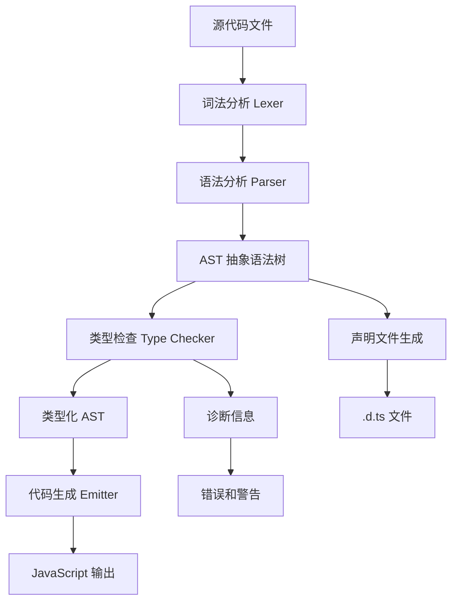
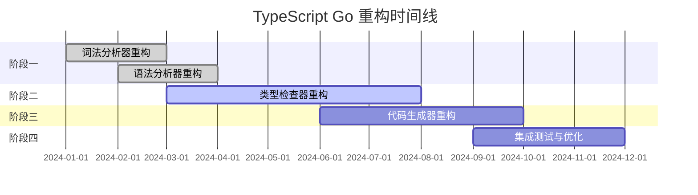

# TypeScript 编译器与配置详解

深入理解 TypeScript 编译器的工作原理、配置选项以及最新发展动态。

## tsconfig.json 精解

### 基础配置结构

```json
{
  "compilerOptions": {
    // 编译选项
  },
  "include": [
    // 包含的文件模式
  ],
  "exclude": [
    // 排除的文件模式
  ],
  "extends": "./base-config.json", // 继承配置
  "files": [
    // 明确指定的文件列表
  ],
  "references": [
    // 项目引用
  ]
}
```

### 核心编译选项详解

#### 基础选项

```json
{
  "compilerOptions": {
    // 目标 JavaScript 版本
    "target": "ES2020", // ES3, ES5, ES2015, ES2016, ES2017, ES2018, ES2019, ES2020, ES2021, ES2022, ESNext
    
    // 模块系统
    "module": "ESNext", // CommonJS, AMD, System, UMD, ES6, ES2015, ES2020, ESNext, Node16, NodeNext
    
    // 模块解析策略
    "moduleResolution": "node", // node, classic, bundler
    
    // 包含的库文件
    "lib": ["ES2020", "DOM", "DOM.Iterable"],
    
    // 输出目录
    "outDir": "./dist",
    
    // 根目录
    "rootDir": "./src",
    
    // 基础路径
    "baseUrl": ".",
    
    // 路径映射
    "paths": {
      "@/*": ["src/*"],
      "@components/*": ["src/components/*"],
      "@utils/*": ["src/utils/*"]
    }
  }
}
```

#### 严格类型检查

```json
{
  "compilerOptions": {
    // 启用所有严格类型检查选项
    "strict": true,
    
    // 等价于以下选项的组合：
    "noImplicitAny": true,           // 禁止隐式 any
    "strictNullChecks": true,        // 严格空值检查
    "strictFunctionTypes": true,     // 严格函数类型检查
    "strictBindCallApply": true,     // 严格 bind/call/apply 检查
    "strictPropertyInitialization": true, // 严格属性初始化检查
    "noImplicitThis": true,          // 禁止隐式 this
    "alwaysStrict": true,            // 始终以严格模式解析
    "exactOptionalPropertyTypes": true, // 精确可选属性类型
    "noImplicitReturns": true,       // 禁止隐式返回
    "noFallthroughCasesInSwitch": true, // 禁止 switch 语句贯穿
    "noUncheckedIndexedAccess": true,   // 禁止未检查的索引访问
    "noImplicitOverride": true,      // 禁止隐式重写
    "noPropertyAccessFromIndexSignature": true // 禁止从索引签名访问属性
  }
}
```

#### 模块和解析选项

```json
{
  "compilerOptions": {
    // ES 模块互操作
    "esModuleInterop": true,
    "allowSyntheticDefaultImports": true,
    
    // 模块检测
    "moduleDetection": "auto", // auto, legacy, force
    
    // 解析 JSON 模块
    "resolveJsonModule": true,
    
    // 允许导入 .ts 扩展名
    "allowImportingTsExtensions": true,
    
    // 类型根目录
    "typeRoots": ["./node_modules/@types", "./types"],
    
    // 包含的类型包
    "types": ["node", "jest", "express"],
    
    // 强制一致的文件名大小写
    "forceConsistentCasingInFileNames": true
  }
}
```

#### 输出控制

```json
{
  "compilerOptions": {
    // 生成声明文件
    "declaration": true,
    "declarationDir": "./types",
    "declarationMap": true,
    
    // 生成源映射
    "sourceMap": true,
    "inlineSourceMap": false,
    "inlineSources": false,
    
    // 移除注释
    "removeComments": true,
    
    // 不生成输出文件
    "noEmit": false,
    "noEmitOnError": true,
    
    // 仅生成声明文件
    "emitDeclarationOnly": false,
    
    // 保留 const 枚举
    "preserveConstEnums": true,
    
    // 导入助手函数
    "importHelpers": true,
    
    // 降级迭代器
    "downlevelIteration": true
  }
}
```

#### 实验性功能

```json
{
  "compilerOptions": {
    // 装饰器支持
    "experimentalDecorators": true,
    "emitDecoratorMetadata": true,
    
    // 使用 define 语义处理类字段
    "useDefineForClassFields": true,
    
    // JSX 支持
    "jsx": "react-jsx", // preserve, react, react-jsx, react-jsxdev, react-native
    "jsxFactory": "React.createElement",
    "jsxFragmentFactory": "React.Fragment",
    "jsxImportSource": "react"
  }
}
```

### 项目引用配置

```json
// 主项目 tsconfig.json
{
  "compilerOptions": {
    "composite": true,
    "declaration": true,
    "declarationMap": true
  },
  "references": [
    { "path": "./packages/core" },
    { "path": "./packages/utils" },
    { "path": "./packages/ui" }
  ]
}

// 子项目 packages/core/tsconfig.json
{
  "extends": "../../tsconfig.base.json",
  "compilerOptions": {
    "composite": true,
    "outDir": "./dist",
    "rootDir": "./src"
  },
  "include": ["src/**/*"],
  "references": [
    { "path": "../utils" }
  ]
}
```

### 配置继承示例

```json
// tsconfig.base.json
{
  "compilerOptions": {
    "target": "ES2020",
    "module": "ESNext",
    "moduleResolution": "node",
    "strict": true,
    "esModuleInterop": true,
    "skipLibCheck": true,
    "forceConsistentCasingInFileNames": true
  }
}

// tsconfig.json (开发环境)
{
  "extends": "./tsconfig.base.json",
  "compilerOptions": {
    "sourceMap": true,
    "noEmit": true
  },
  "include": ["src/**/*", "tests/**/*"]
}

// tsconfig.build.json (生产构建)
{
  "extends": "./tsconfig.base.json",
  "compilerOptions": {
    "outDir": "./dist",
    "declaration": true,
    "removeComments": true
  },
  "include": ["src/**/*"],
  "exclude": ["**/*.test.ts", "**/*.spec.ts"]
}
```

## TypeScript 编译器 (tsc) 核心流程解析

### 编译流程概览



### 1. 词法分析阶段 (Lexical Analysis)

```typescript
// 源代码
const message: string = "Hello, TypeScript!";

// 词法分析后的 Token 流
[
  { kind: SyntaxKind.ConstKeyword, text: "const" },
  { kind: SyntaxKind.Identifier, text: "message" },
  { kind: SyntaxKind.ColonToken, text: ": " },
  { kind: SyntaxKind.StringKeyword, text: "string" },
  { kind: SyntaxKind.EqualsToken, text: " = " },
  { kind: SyntaxKind.StringLiteral, text: '"Hello, TypeScript!"' },
  { kind: SyntaxKind.SemicolonToken, text: ";" }
]
```

### 2. 语法分析阶段 (Parsing)

```typescript
// AST 节点结构示例
interface VariableStatement {
  kind: SyntaxKind.VariableStatement;
  declarationList: {
    kind: SyntaxKind.VariableDeclarationList;
    flags: NodeFlags.Const;
    declarations: [{
      kind: SyntaxKind.VariableDeclaration;
      name: { kind: SyntaxKind.Identifier; text: "message" };
      type: { kind: SyntaxKind.StringKeyword };
      initializer: { 
        kind: SyntaxKind.StringLiteral; 
        text: "Hello, TypeScript!" 
      };
    }];
  };
}
```

### 3. 类型检查阶段 (Type Checking)

```typescript
// 类型检查器的核心职责
class TypeChecker {
  // 符号表管理
  private symbolTable: Map<string, Symbol> = new Map();
  
  // 类型推断
  inferType(node: Expression): Type {
    switch (node.kind) {
      case SyntaxKind.StringLiteral:
        return this.stringType;
      case SyntaxKind.NumericLiteral:
        return this.numberType;
      case SyntaxKind.Identifier:
        return this.getTypeOfSymbol(this.getSymbol(node));
      // ... 更多类型推断逻辑
    }
  }
  
  // 类型兼容性检查
  isTypeAssignableTo(source: Type, target: Type): boolean {
    // 结构化类型系统的兼容性检查
    if (source === target) return true;
    if (target.flags & TypeFlags.Any) return true;
    if (source.flags & TypeFlags.Never) return true;
    
    // 对象类型兼容性
    if (source.flags & TypeFlags.Object && target.flags & TypeFlags.Object) {
      return this.isObjectTypeAssignableTo(source, target);
    }
    
    return false;
  }
  
  // 泛型实例化
  instantiateType(type: Type, typeArguments: Type[]): Type {
    if (type.flags & TypeFlags.TypeParameter) {
      const index = (type as TypeParameter).index;
      return typeArguments[index] || type;
    }
    // ... 更多实例化逻辑
    return type;
  }
}
```

### 4. 代码生成阶段 (Emit)

```typescript
// 代码生成器示例
class Emitter {
  private output: string = "";
  
  emitVariableStatement(node: VariableStatement): void {
    const declaration = node.declarationList.declarations[0];
    const isConst = node.declarationList.flags & NodeFlags.Const;
    
    // 根据目标版本选择关键字
    const keyword = this.target >= ScriptTarget.ES2015 && isConst ? "const" : "var";
    
    this.output += `${keyword} ${declaration.name.text}`;
    
    if (declaration.initializer) {
      this.output += " = ";
      this.emitExpression(declaration.initializer);
    }
    
    this.output += ";\n";
  }
  
  emitTypeAssertion(node: TypeAssertion): void {
    // TypeScript: value as Type
    // JavaScript: value (类型断言被移除)
    this.emitExpression(node.expression);
  }
}
```

### 编译器 API 使用示例

```typescript
import * as ts from "typescript";

// 创建编译器程序
function createProgram(fileNames: string[], options: ts.CompilerOptions): ts.Program {
  return ts.createProgram(fileNames, options);
}

// 类型检查
function typeCheck(program: ts.Program): void {
  const checker = program.getTypeChecker();
  
  for (const sourceFile of program.getSourceFiles()) {
    if (!sourceFile.isDeclarationFile) {
      ts.forEachChild(sourceFile, visit);
    }
  }
  
  function visit(node: ts.Node) {
    if (ts.isVariableDeclaration(node) && node.initializer) {
      const type = checker.getTypeAtLocation(node.initializer);
      const typeString = checker.typeToString(type);
      console.log(`Variable ${node.name.getText()} has type: ${typeString}`);
    }
    
    ts.forEachChild(node, visit);
  }
}

// 自定义转换器
function createTransformer(): ts.TransformerFactory<ts.SourceFile> {
  return (context: ts.TransformationContext) => {
    return (sourceFile: ts.SourceFile) => {
      function visitor(node: ts.Node): ts.Node {
        // 移除所有 console.log 调用
        if (ts.isCallExpression(node) && 
            ts.isPropertyAccessExpression(node.expression) &&
            node.expression.expression.getText() === "console" &&
            node.expression.name.text === "log") {
          return ts.factory.createVoidZero();
        }
        
        return ts.visitEachChild(node, visitor, context);
      }
      
      return ts.visitNode(sourceFile, visitor);
    };
  };
}
```

## 为什么最近 TypeScript 用 Go 重构

### 背景与动机

#### 1. 性能瓶颈

```typescript
// 当前 TypeScript 编译器的性能问题

// 大型项目编译时间
interface CompilationStats {
  projectSize: string;
  currentCompileTime: string;
  targetCompileTime: string;
  improvement: string;
}

const performanceComparison: CompilationStats[] = [
  {
    projectSize: "小型项目 (<100 文件)",
    currentCompileTime: "2-5 秒",
    targetCompileTime: "<1 秒",
    improvement: "50-80%"
  },
  {
    projectSize: "中型项目 (100-1000 文件)",
    currentCompileTime: "10-30 秒",
    targetCompileTime: "3-8 秒",
    improvement: "60-75%"
  },
  {
    projectSize: "大型项目 (>1000 文件)",
    currentCompileTime: "1-5 分钟",
    targetCompileTime: "10-30 秒",
    improvement: "70-90%"
  }
];
```

#### 2. 内存使用优化

```go
// Go 版本的内存管理优势
package main

import (
    "fmt"
    "runtime"
    "sync"
)

// 并发类型检查
type TypeChecker struct {
    symbolTable sync.Map
    typeCache   sync.Map
    workers     int
}

func (tc *TypeChecker) CheckFilesParallel(files []string) {
    semaphore := make(chan struct{}, tc.workers)
    var wg sync.WaitGroup
    
    for _, file := range files {
        wg.Add(1)
        go func(filename string) {
            defer wg.Done()
            semaphore <- struct{}{} // 获取信号量
            defer func() { <-semaphore }() // 释放信号量
            
            tc.checkFile(filename)
        }(file)
    }
    
    wg.Wait()
}

// 内存池复用
var astNodePool = sync.Pool{
    New: func() interface{} {
        return &ASTNode{}
    },
}

func (tc *TypeChecker) parseFile(filename string) *ASTNode {
    node := astNodePool.Get().(*ASTNode)
    defer astNodePool.Put(node)
    
    // 解析逻辑
    return node
}
```

#### 3. 并发处理能力

```go
// Go 的并发优势：Goroutines
package compiler

import (
    "context"
    "sync"
)

type CompilerPipeline struct {
    lexerChan   chan LexerJob
    parserChan  chan ParserJob
    checkerChan chan CheckerJob
    emitterChan chan EmitterJob
}

func (cp *CompilerPipeline) ProcessFiles(ctx context.Context, files []string) {
    var wg sync.WaitGroup
    
    // 启动各阶段的 worker goroutines
    for i := 0; i < runtime.NumCPU(); i++ {
        wg.Add(4)
        
        // 词法分析 worker
        go func() {
            defer wg.Done()
            for job := range cp.lexerChan {
                tokens := lexicalAnalysis(job.source)
                cp.parserChan <- ParserJob{tokens: tokens, file: job.file}
            }
        }()
        
        // 语法分析 worker
        go func() {
            defer wg.Done()
            for job := range cp.parserChan {
                ast := syntaxAnalysis(job.tokens)
                cp.checkerChan <- CheckerJob{ast: ast, file: job.file}
            }
        }()
        
        // 类型检查 worker
        go func() {
            defer wg.Done()
            for job := range cp.checkerChan {
                typedAst := typeCheck(job.ast)
                cp.emitterChan <- EmitterJob{ast: typedAst, file: job.file}
            }
        }()
        
        // 代码生成 worker
        go func() {
            defer wg.Done()
            for job := range cp.emitterChan {
                emit(job.ast, job.file)
            }
        }()
    }
    
    // 提交任务
    for _, file := range files {
        select {
        case cp.lexerChan <- LexerJob{source: readFile(file), file: file}:
        case <-ctx.Done():
            return
        }
    }
    
    close(cp.lexerChan)
    wg.Wait()
}
```

### 技术对比分析

#### JavaScript/Node.js vs Go

```typescript
// 当前 TypeScript 编译器的限制
interface CompilerLimitations {
  singleThreaded: boolean;        // 主要是单线程处理
  memoryIntensive: boolean;       // 内存使用较高
  gcPressure: boolean;           // GC 压力大
  startupTime: number;           // 启动时间长
}

const currentLimitations: CompilerLimitations = {
  singleThreaded: true,
  memoryIntensive: true,
  gcPressure: true,
  startupTime: 500 // ms
};

// Go 版本的优势
interface GoAdvantages {
  nativeParallelism: boolean;     // 原生并发支持
  lowMemoryFootprint: boolean;    // 低内存占用
  fastStartup: boolean;          // 快速启动
  staticBinary: boolean;         // 静态二进制文件
}

const goAdvantages: GoAdvantages = {
  nativeParallelism: true,
  lowMemoryFootprint: true,
  fastStartup: true,
  staticBinary: true
};
```

### 迁移策略

#### 1. 渐进式重构



#### 2. 兼容性保证

```go
// Go 版本保持 API 兼容性
package typescript

import "C"

// 导出给 Node.js 的 C API
//export compile
func compile(source *C.char, options *C.char) *C.char {
    goSource := C.GoString(source)
    goOptions := C.GoString(options)
    
    result := CompileTypeScript(goSource, goOptions)
    return C.CString(result)
}

// 保持现有的 TypeScript API
func CompileTypeScript(source string, options string) string {
    compiler := NewCompiler()
    return compiler.Compile(source, ParseOptions(options))
}

//export getVersion
func getVersion() *C.char {
    return C.CString("5.0.0-go")
}

func main() {} // 必需的 main 函数
```

### 预期收益

```typescript
interface PerformanceGains {
  category: string;
  currentPerformance: string;
  expectedImprovement: string;
  impact: 'High' | 'Medium' | 'Low';
}

const expectedGains: PerformanceGains[] = [
  {
    category: "编译速度",
    currentPerformance: "基准",
    expectedImprovement: "3-10x 提升",
    impact: "High"
  },
  {
    category: "内存使用",
    currentPerformance: "基准",
    expectedImprovement: "50-70% 减少",
    impact: "High"
  },
  {
    category: "启动时间",
    currentPerformance: "500ms",
    expectedImprovement: "<50ms",
    impact: "Medium"
  },
  {
    category: "并发处理",
    currentPerformance: "有限",
    expectedImprovement: "原生支持",
    impact: "High"
  },
  {
    category: "部署便利性",
    currentPerformance: "需要 Node.js",
    expectedImprovement: "单一二进制文件",
    impact: "Medium"
  }
];
```

## interface 和 type 的主要区别

### 基础语法差异

```typescript
// Interface 声明
interface User {
  id: number;
  name: string;
  email: string;
}

// Type 别名声明
type User = {
  id: number;
  name: string;
  email: string;
};
```

### 1. 扩展能力对比

#### Interface 扩展

```typescript
// Interface 继承
interface Animal {
  name: string;
  age: number;
}

interface Dog extends Animal {
  breed: string;
  bark(): void;
}

// 多重继承
interface Flyable {
  fly(): void;
}

interface Swimmable {
  swim(): void;
}

interface Duck extends Animal, Flyable, Swimmable {
  quack(): void;
}

// Interface 声明合并
interface Window {
  title: string;
}

interface Window {
  ts: TypeScriptAPI;
}

// 合并后的 Window 接口
// interface Window {
//   title: string;
//   ts: TypeScriptAPI;
// }
```

#### Type 扩展

```typescript
// Type 交叉类型
type Animal = {
  name: string;
  age: number;
};

type Dog = Animal & {
  breed: string;
  bark(): void;
};

// 复杂的交叉类型
type Flyable = {
  fly(): void;
};

type Swimmable = {
  swim(): void;
};

type Duck = Animal & Flyable & Swimmable & {
  quack(): void;
};

// Type 不支持声明合并
// type Window = { title: string; };
// type Window = { ts: TypeScriptAPI; }; // Error: 重复标识符
```

### 2. 支持的类型范围

#### Interface 限制

```typescript
// Interface 只能描述对象类型
interface StringArray {
  [index: number]: string;
}

interface Function {
  (x: number): number;
}

// Interface 不能描述原始类型、联合类型等
// interface StringOrNumber = string | number; // Error
// interface StringAlias = string; // Error
```

#### Type 的灵活性

```typescript
// Type 可以描述任何类型
type StringOrNumber = string | number;
type StringAlias = string;
type NumberArray = number[];
type Tuple = [string, number, boolean];

// 联合类型
type Status = 'loading' | 'success' | 'error';

// 条件类型
type NonNullable<T> = T extends null | undefined ? never : T;

// 映射类型
type Partial<T> = {
  [P in keyof T]?: T[P];
};

// 模板字面量类型
type EventName<T extends string> = `on${Capitalize<T>}`;
type ClickEvent = EventName<'click'>; // 'onClick'

// 函数类型
type Handler = (event: Event) => void;
type AsyncHandler = (event: Event) => Promise<void>;

// 复杂的工具类型
type DeepReadonly<T> = {
  readonly [P in keyof T]: T[P] extends object ? DeepReadonly<T[P]> : T[P];
};
```

### 3. 计算属性和动态键

```typescript
// Interface 中的计算属性
interface DynamicInterface {
  [key: string]: any;
  [key: number]: string;
}

// Type 中的更灵活的键类型
type DynamicKeys = 'name' | 'age' | 'email';
type DynamicType = {
  [K in DynamicKeys]: string;
};

// 模板字面量键
type Getters<T> = {
  [K in keyof T as `get${Capitalize<string & K>}`]: () => T[K];
};

type UserGetters = Getters<{ name: string; age: number }>;
// {
//   getName: () => string;
//   getAge: () => number;
// }
```

### 4. 性能和编译差异

```typescript
// Interface 的性能优势
interface LargeInterface {
  prop1: string;
  prop2: number;
  // ... 100+ 属性
  prop100: boolean;
}

// 继承时的性能
interface ExtendedInterface extends LargeInterface {
  newProp: string;
}

// Type 的性能考虑
type LargeType = {
  prop1: string;
  prop2: number;
  // ... 100+ 属性
  prop100: boolean;
};

// 交叉类型的性能影响
type ExtendedType = LargeType & {
  newProp: string;
};

// 复杂类型计算的性能影响
type ComplexType<T> = {
  [K in keyof T]: T[K] extends string 
    ? `processed_${T[K]}` 
    : T[K] extends number 
    ? T[K] * 2 
    : T[K];
};
```

### 5. 实际使用场景对比

#### 推荐使用 Interface 的场景

```typescript
// 1. 定义对象的形状
interface ApiResponse {
  data: any;
  status: number;
  message: string;
}

// 2. 类的契约
interface Drawable {
  draw(): void;
}

class Circle implements Drawable {
  draw() {
    console.log('Drawing a circle');
  }
}

// 3. 需要声明合并的场景
interface CustomWindow {
  customProperty: string;
}

// 在其他文件中扩展
interface CustomWindow {
  anotherProperty: number;
}

// 4. 公共 API 定义
interface PublicAPI {
  version: string;
  methods: {
    get(path: string): Promise<any>;
    post(path: string, data: any): Promise<any>;
  };
}
```

#### 推荐使用 Type 的场景

```typescript
// 1. 联合类型
type Theme = 'light' | 'dark' | 'auto';
type Size = 'small' | 'medium' | 'large';

// 2. 工具类型和类型操作
type Optional<T, K extends keyof T> = Omit<T, K> & Partial<Pick<T, K>>;
type RequiredUser = Optional<User, 'email'>;

// 3. 条件类型
type ApiResult<T> = T extends string 
  ? { message: T } 
  : T extends number 
  ? { code: T } 
  : { data: T };

// 4. 复杂的类型计算
type FunctionPropertyNames<T> = {
  [K in keyof T]: T[K] extends Function ? K : never;
}[keyof T];

type FunctionProperties<T> = Pick<T, FunctionPropertyNames<T>>;

// 5. 原始类型别名
type ID = string | number;
type Timestamp = number;
type JSONValue = string | number | boolean | null | JSONObject | JSONArray;
type JSONObject = { [key: string]: JSONValue };
type JSONArray = JSONValue[];
```

### 6. 错误信息差异

```typescript
// Interface 错误信息
interface User {
  name: string;
  age: number;
}

const user: User = {
  name: 'John',
  // age: '25' // Error: Type 'string' is not assignable to type 'number'
};

// Type 错误信息
type UserType = {
  name: string;
  age: number;
};

const userType: UserType = {
  name: 'John',
  // age: '25' // Error: Type 'string' is not assignable to type 'number'
};

// 复杂类型的错误信息可能更难理解
type ComplexUser = User & { permissions: string[] } & { settings: object };

const complexUser: ComplexUser = {
  name: 'John',
  age: 25,
  permissions: ['read'],
  // settings: 'invalid' // 错误信息可能较长且复杂
};
```

### 选择建议

```typescript
// 决策树
type TypeOrInterface<T> = 
  T extends 'object_shape' ? 'interface' :
  T extends 'class_contract' ? 'interface' :
  T extends 'declaration_merging' ? 'interface' :
  T extends 'union_types' ? 'type' :
  T extends 'computed_types' ? 'type' :
  T extends 'primitive_alias' ? 'type' :
  T extends 'complex_operations' ? 'type' :
  'either'; // 两者都可以

// 最佳实践总结
interface BestPractices {
  // 优先使用 interface 的情况
  useInterface: [
    '定义对象结构',
    '类的实现契约',
    '需要声明合并',
    '公共 API 定义',
    '简单的继承关系'
  ];
  
  // 优先使用 type 的情况
  useType: [
    '联合类型',
    '交叉类型',
    '条件类型',
    '映射类型',
    '原始类型别名',
    '复杂类型计算',
    '工具类型定义'
  ];
  
  // 性能考虑
  performance: {
    interface: '继承性能更好，错误信息更清晰';
    type: '复杂类型计算可能影响编译性能';
  };
}
```

## any vs unknown vs never

### any - 类型系统的逃生舱

```typescript
// any 的特点：关闭类型检查
let anyValue: any = 42;

// 可以赋值为任何类型
anyValue = 'hello';
anyValue = true;
anyValue = { name: 'John' };
anyValue = [1, 2, 3];
anyValue = () => console.log('function');

// 可以访问任何属性（即使不存在）
console.log(anyValue.foo.bar.baz); // 不会报错，但运行时可能出错

// 可以调用任何方法
anyValue.nonExistentMethod(); // 不会报错，但运行时出错

// 可以作为任何类型使用
const str: string = anyValue; // 不会报错
const num: number = anyValue; // 不会报错
const obj: { name: string } = anyValue; // 不会报错
```

#### any 的使用场景

```typescript
// 1. 迁移 JavaScript 代码
function legacyFunction(data: any) {
  // 逐步添加类型
  return data;
}

// 2. 第三方库没有类型定义
declare const thirdPartyLib: any;
thirdPartyLib.someMethod();

// 3. 动态内容（但通常有更好的替代方案）
function processJson(json: string): any {
  return JSON.parse(json);
}

// 4. 复杂的类型操作（临时使用）
function complexTransform(input: any): any {
  // 复杂的数据转换逻辑
  return input;
}
```

#### any 的问题和风险

```typescript
// 类型安全丢失
function dangerousFunction(value: any) {
  // 这些操作都不会报错，但可能在运行时失败
  return value.toUpperCase().split('').reverse().join('');
}

// 运行时错误
// dangerousFunction(123); // TypeError: value.toUpperCase is not a function
// dangerousFunction(null); // TypeError: Cannot read property 'toUpperCase' of null

// 智能提示丢失
let anyObj: any = { name: 'John', age: 30 };
// 没有智能提示，容易拼写错误
anyObj.naem; // 应该是 name，但不会报错

// 重构困难
function updateUser(user: any) {
  user.name = 'Updated';
  // 如果 User 接口改变，这里不会得到提示
}
```

### unknown - 类型安全的 any

```typescript
// unknown 的特点：类型安全的顶级类型
let unknownValue: unknown = 42;

// 可以赋值为任何类型
unknownValue = 'hello';
unknownValue = true;
unknownValue = { name: 'John' };
unknownValue = [1, 2, 3];

// 但不能直接使用
// console.log(unknownValue.length); // Error: Object is of type 'unknown'
// unknownValue.toUpperCase(); // Error: Object is of type 'unknown'
// unknownValue(); // Error: Object is of type 'unknown'

// 需要类型检查后才能使用
if (typeof unknownValue === 'string') {
  console.log(unknownValue.length); // OK: TypeScript 知道这里是 string
  console.log(unknownValue.toUpperCase()); // OK
}

if (Array.isArray(unknownValue)) {
  console.log(unknownValue.length); // OK: TypeScript 知道这里是数组
  unknownValue.push(4); // OK
}
```

#### unknown 的类型守卫

```typescript
// 类型守卫函数
function isString(value: unknown): value is string {
  return typeof value === 'string';
}

function isNumber(value: unknown): value is number {
  return typeof value === 'number';
}

function isObject(value: unknown): value is Record<string, unknown> {
  return typeof value === 'object' && value !== null && !Array.isArray(value);
}

// 使用类型守卫
function processUnknown(value: unknown) {
  if (isString(value)) {
    return value.toUpperCase(); // TypeScript 知道这里是 string
  }
  
  if (isNumber(value)) {
    return value * 2; // TypeScript 知道这里是 number
  }
  
  if (isObject(value)) {
    return Object.keys(value); // TypeScript 知道这里是 object
  }
  
  throw new Error('Unsupported type');
}

// 更复杂的类型守卫
interface User {
  name: string;
  age: number;
}

function isUser(value: unknown): value is User {
  return (
    isObject(value) &&
    'name' in value &&
    'age' in value &&
    typeof value.name === 'string' &&
    typeof value.age === 'number'
  );
}

function processUser(data: unknown) {
  if (isUser(data)) {
    console.log(`User: ${data.name}, Age: ${data.age}`); // 类型安全
  } else {
    throw new Error('Invalid user data');
  }
}
```

#### unknown 的实际应用

```typescript
// 1. API 响应处理
async function fetchData(url: string): Promise<unknown> {
  const response = await fetch(url);
  return response.json(); // JSON.parse 返回 any，但我们用 unknown 更安全
}

// 安全的数据处理
async function getUserData(userId: string) {
  const data = await fetchData(`/api/users/${userId}`);
  
  if (isUser(data)) {
    return data; // 类型安全的 User
  }
  
  throw new Error('Invalid user data received');
}

// 2. 错误处理
function handleError(error: unknown) {
  if (error instanceof Error) {
    console.error('Error message:', error.message);
    console.error('Stack trace:', error.stack);
  } else if (typeof error === 'string') {
    console.error('String error:', error);
  } else {
    console.error('Unknown error:', error);
  }
}

try {
  // 一些可能抛出任何类型错误的代码
  riskyOperation();
} catch (error) {
  handleError(error); // error 是 unknown 类型
}

// 3. 配置对象验证
interface Config {
  apiUrl: string;
  timeout: number;
  retries: number;
}

function isConfig(value: unknown): value is Config {
  return (
    isObject(value) &&
    'apiUrl' in value &&
    'timeout' in value &&
    'retries' in value &&
    typeof value.apiUrl === 'string' &&
    typeof value.timeout === 'number' &&
    typeof value.retries === 'number'
  );
}

function loadConfig(configData: unknown): Config {
  if (isConfig(configData)) {
    return configData;
  }
  
  throw new Error('Invalid configuration');
}
```

### never - 永不存在的类型

```typescript
// never 的特点：表示永远不会发生的类型

// 1. 永远不会返回的函数
function throwError(message: string): never {
  throw new Error(message);
}

function infiniteLoop(): never {
  while (true) {
    // 无限循环
  }
}

// 2. 不可能的联合类型
type Impossible = string & number; // never，因为没有值既是 string 又是 number

// 3. 穷尽性检查
type Color = 'red' | 'green' | 'blue';

function getColorName(color: Color): string {
  switch (color) {
    case 'red':
      return 'Red';
    case 'green':
      return 'Green';
    case 'blue':
      return 'Blue';
    default:
      // 如果所有情况都处理了，这里的 color 类型是 never
      const exhaustiveCheck: never = color;
      return exhaustiveCheck; // 这行永远不会执行
  }
}

// 如果添加新的颜色但忘记处理，TypeScript 会报错
type ExtendedColor = 'red' | 'green' | 'blue' | 'yellow';

function getExtendedColorName(color: ExtendedColor): string {
  switch (color) {
    case 'red':
      return 'Red';
    case 'green':
      return 'Green';
    case 'blue':
      return 'Blue';
    default:
      // Error: Type 'string' is not assignable to type 'never'
      // 因为 'yellow' 没有被处理
      const exhaustiveCheck: never = color;
      return exhaustiveCheck;
  }
}
```

#### never 的高级应用

```typescript
// 1. 条件类型中的 never
type NonNullable<T> = T extends null | undefined ? never : T;

type Result1 = NonNullable<string | null>; // string
type Result2 = NonNullable<number | undefined>; // number
type Result3 = NonNullable<null>; // never

// 2. 映射类型中的 never
type FunctionPropertyNames<T> = {
  [K in keyof T]: T[K] extends Function ? K : never;
}[keyof T];

type Example = {
  name: string;
  age: number;
  getName: () => string;
  setAge: (age: number) => void;
};

type FuncNames = FunctionPropertyNames<Example>; // 'getName' | 'setAge'

// 3. 过滤类型
type FilterOut<T, U> = T extends U ? never : T;

type WithoutStrings = FilterOut<string | number | boolean, string>; // number | boolean

// 4. 递归类型中的终止条件
type DeepReadonly<T> = {
  readonly [P in keyof T]: T[P] extends object 
    ? T[P] extends Function 
      ? T[P] 
      : DeepReadonly<T[P]>
    : T[P];
};

// 5. 类型安全的断言
function assertNever(value: never): never {
  throw new Error(`Unexpected value: ${value}`);
}

type Status = 'loading' | 'success' | 'error';

function handleStatus(status: Status) {
  switch (status) {
    case 'loading':
      return 'Loading...';
    case 'success':
      return 'Success!';
    case 'error':
      return 'Error occurred';
    default:
      return assertNever(status); // 确保所有情况都被处理
  }
}
```

### 三者对比总结

```typescript
// 类型安全性对比
interface TypeSafetyComparison {
  any: {
    safety: 'None'; // 完全关闭类型检查
    usage: 'Direct'; // 可以直接使用
    errors: 'Runtime'; // 错误在运行时发现
    migration: 'Easy'; // 容易从 JS 迁移
  };
  
  unknown: {
    safety: 'High'; // 类型安全
    usage: 'Guarded'; // 需要类型守卫
    errors: 'Compile-time'; // 错误在编译时发现
    migration: 'Gradual'; // 渐进式类型化
  };
  
  never: {
    safety: 'Absolute'; // 绝对类型安全
    usage: 'Impossible'; // 不能有值
    errors: 'Compile-time'; // 编译时检查
    purpose: 'Type-level'; // 类型级别的逻辑
  };
}

// 使用场景总结
type UsageRecommendations = {
  any: [
    '迁移遗留 JavaScript 代码',
    '第三方库缺少类型定义',
    '快速原型开发（临时使用）',
    '复杂类型操作的临时解决方案'
  ];
  
  unknown: [
    'API 响应处理',
    '用户输入验证',
    '错误处理',
    '配置对象验证',
    '类型安全的 JSON 解析',
    '替代 any 的更安全选择'
  ];
  
  never: [
    '穷尽性检查',
    '不可达代码标记',
    '条件类型中的排除',
    '类型级别的逻辑控制',
    '函数永不返回的标记'
  ];
};

// 最佳实践
const bestPractices = {
  avoidAny: '尽量避免使用 any，它会破坏 TypeScript 的类型安全',
  preferUnknown: '当类型不确定时，优先使用 unknown 而不是 any',
  useNever: '利用 never 进行穷尽性检查，确保代码的完整性',
  gradualTyping: '从 any 逐步迁移到具体类型或 unknown',
  typeGuards: '为 unknown 类型编写类型守卫函数'
} as const;
```

### 实际项目中的应用示例

```typescript
// 综合示例：类型安全的数据处理管道
class DataProcessor {
  // 使用 unknown 接收不确定的数据
  async processData(rawData: unknown): Promise<ProcessedData> {
    // 验证数据格式
    if (!this.isValidInput(rawData)) {
      // 使用 never 标记不可能的情况
      return this.handleInvalidData(rawData);
    }
    
    // 类型安全的处理
    return this.transformData(rawData);
  }
  
  private isValidInput(data: unknown): data is RawData {
    return (
      typeof data === 'object' &&
      data !== null &&
      'id' in data &&
      'content' in data
    );
  }
  
  private handleInvalidData(data: unknown): never {
    throw new Error(`Invalid data format: ${JSON.stringify(data)}`);
  }
  
  private transformData(data: RawData): ProcessedData {
    // 类型安全的数据转换
    return {
      id: data.id,
      processedContent: data.content.toUpperCase(),
      timestamp: Date.now()
    };
  }
}

interface RawData {
  id: string;
  content: string;
}

interface ProcessedData {
  id: string;
  processedContent: string;
  timestamp: number;
}
```

通过理解 `any`、`unknown` 和 `never` 的区别和适用场景，我们可以编写更加类型安全和健壮的 TypeScript 代码。